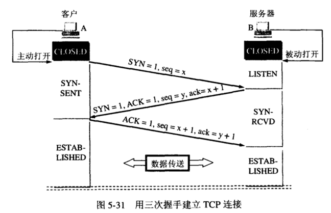
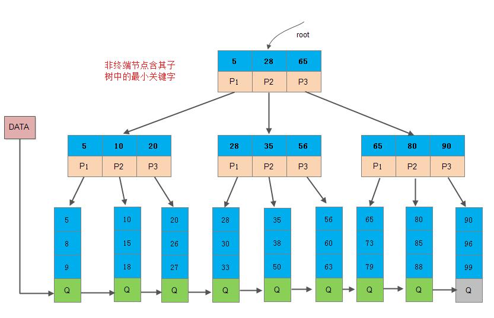
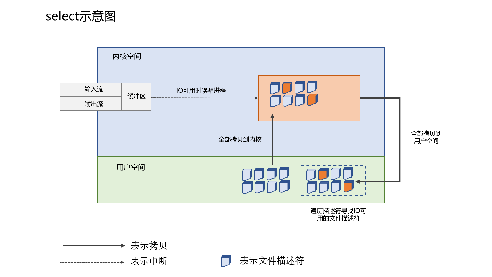
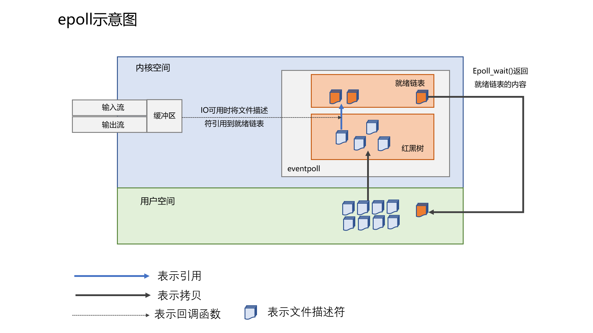
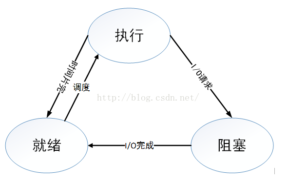
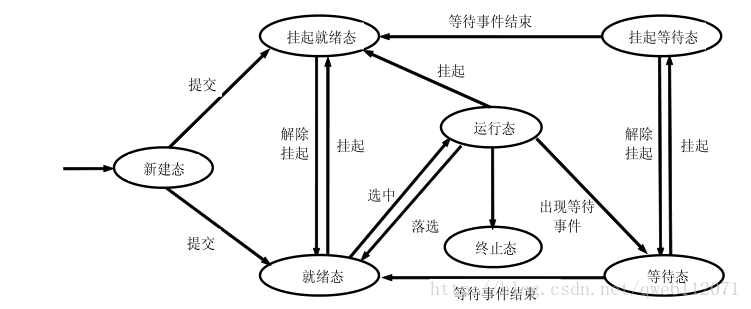
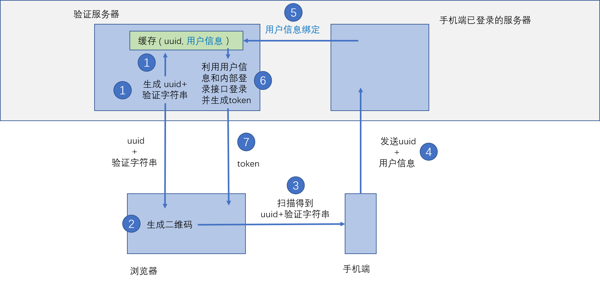

# 1. 语言基础 (C/C++)

#### （0） 指针和引用的区别
* 指针是一个新的变量，指向另一个变量的地址，我们可以通过访问这个地址来修改另一个变量；而引用是一个别名，对引用的操作就是对变量的本身进行操作
* 指针可以有多级，引用只有一级
* 传参的时候，使用指针的话需要解引用才能对参数进行修改，而使用引用可以直接对参数进行修改
* 指针的大小一般是4个字节，引用的大小取决于被引用对象的大小
* 指针可以为空，引用不可以。

#### （1）在函数参数传递的时候，什么时候使用指针，什么时候使用引用？
* 需要返回函数内局部变量的内存的时候用指针。使用指针传参需要开辟内存，用完要记得释放指针，不然会内存泄漏。而返回局部变量的引用是没有意义的
* 对栈空间大小比较敏感（比如递归）的时候使用引用。使用引用传递不需要创建临时变量，开销要更小
* 类对象作为参数传递的时候使用引用，这是C++类对象传递的标准方式
#### （2） 堆和栈有什么区别
* 从定义上：堆是由new和malloc开辟的一块内存，由程序员手动管理，栈是编译器自动管理的内存，存放函数的参数和局部变量。
* 堆空间因为会有频繁的分配释放操作，会产生内存碎片
* 堆的生长空间向上，地址越来越大，栈的生长空间向下，地址越来越小
#### （3）堆快一点还是栈快一点？（字节提前批一面）
栈快一点。因为操作系统会在底层对栈提供支持，会分配专门的寄存器存放栈的地址，栈的入栈出栈操作也十分简单，并且有专门的指令执行，所以栈的效率比较高也比较快。而堆的操作是由C/C++函数库提供的，在分配堆内存的时候需要一定的算法寻找合适大小的内存。并且获取堆的内容需要两次访问，第一次访问指针，第二次根据指针保存的地址访问内存，因此堆比较慢。
#### （4） new和delete是如何实现的，new 与 malloc的异同处
在new一个对象的时候，首先会调用malloc为对象分配内存空间，然后调用对象的构造函数。delete会调用对象的析构函数，然后调用free回收内存。

new与malloc都会分配空间，但是new还会调用对象的构造函数进行初始化，malloc需要给定空间大小，而new只需要对象名
#### （5）既然有了malloc/free，C++中为什么还需要new/delete呢？
https://blog.csdn.net/leikun153/article/details/80612130

* malloc/free和new/delete都是用来申请内存和回收内存的。
* 在对非基本数据类型的对象使用的时候，对象创建的时候还需要执行构造函数，销毁的时候要执行析构函数。而malloc/free是库函数，是已经编译的代码，所以不能把构造函数和析构函数的功能强加给malloc/free。
#### （6） C和C\+\+的区别
包括但不限于：
* C是面向过程的语言，C\+\+是面向对象的语言，C\+\+有“封装，继承和多态”的特性。封装隐藏了实现细节，使得代码模块化。继承通过子类继承父类的方法和属性，实现了代码重用。多态则是“一个接口，多个实现”，通过子类重写父类的虚函数，实现了接口重用。
  + 动态多态
  + 静态多态
  + 重载与重写
* C和C\+\+内存管理的方法不一样，C使用malloc/free，C\+\+除此之外还用new/delete
* C\+\+中还有函数重载和引用等概念，C中没有
#### （7）delete和delete\[\]的区别

* delete只会调用一次析构函数，而delete\[\]会调用每个成员的析构函数

* 用new分配的内存用delete释放，用new\[\]分配的内存用delete\[\]释放

#### （8） C++、Java的联系与区别，包括语言特性、垃圾回收、应用场景等（java的垃圾回收机制）
包括但不限于：
* C\+\+ 和Java都是面向对象的语言，C\+\+是编译成可执行文件直接运行的，JAVA是编译之后在JAVA虚拟机上运行的，因此JAVA有良好的跨平台特性，但是执行效率没有C\+\+ 高。
* C\+\+的内存管理由程序员手动管理，JAVA的内存管理是由Java虚拟机完成的，它的垃圾回收使用的是标记-回收算法
* C\+\+有指针，Java没有指针，只有引用
* JAVA和C\+\+都有构造函数，但是C\+\+有析构函数但是Java没有
#### （9）C++和python的区别
包括但不限于：
1. python是一种脚本语言，是解释执行的，而C\+\+是编译语言，是需要编译后在特定平台运行的。python可以很方便的跨平台，但是效率没有C\+\+高。
2. python使用缩进来区分不同的代码块，C\+\+使用花括号来区分
3. C\+\+中需要事先定义变量的类型，而python不需要，python的基本数据类型只有数字，布尔值，字符串，列表，元组等等
4. python的库函数比C\+\+的多，调用起来很方便
#### （10） Struct和class的区别
* 使用struct时，它的成员的访问权限默认是public的，而class的成员默认是private的
* struct的继承默认是public继承，而class的继承默认是private继承
* class可以用作模板，而struct不能
#### （11） define 和const的联系与区别（编译阶段、安全性、内存占用等）
  联系：它们都是定义常量的一种方法。

  区别：
* define定义的常量没有类型，只是进行了简单的替换，可能会有多个拷贝，占用的内存空间大，const定义的常量是有类型的，存放在静态存储区，只有一个拷贝，占用的内存空间小。
* define定义的常量是在预处理阶段进行替换，而const在编译阶段确定它的值。
* define不会进行类型安全检查，而const会进行类型安全检查，安全性更高。
* const可以定义函数而define不可以。
#### （12） 在C\+\+中const的用法（定义，用途）
* const修饰类的成员变量时，表示常量不能被修改
* const修饰类的成员函数，表示该函数不会修改类中的数据成员，不会调用其他非const的成员函数

#### （13） C++中的static用法和意义
static的意思是静态的，可以用来修饰变量，函数和类成员。
* 变量：被static修饰的变量就是静态变量，它会在程序运行过程中一直存在，会被放在静态存储区。局部静态变量的作用域在函数体中，全局静态变量的作用域在这个文件里。

* 函数：被static修饰的函数就是静态函数，静态函数只能在本文件中使用，不能被其他文件调用，也不会和其他文件中的同名函数冲突。

* 类：而在类中，被static修饰的成员变量是类静态成员，这个静态成员会被类的多个对象共用。被static修饰的成员函数也属于静态成员，不是属于某个对象的，**访问这个静态函数不需要引用对象名，而是通过引用类名来访问。**

【note】静态成员函数要访问非静态成员时，要用过对象来引用。局部静态变量在函数调用结束后也不会被回收，会一直在程序内存中，直到该函数再次被调用，它的值还是保持上一次调用结束后的值。

注意和const的区别。const强调值不能被修改，而static强调唯一的拷贝，对所有类的对象都共用。
#### （14） 计算下面几个类的大小：
```C++
class A {};
int main(){
  cout<<sizeof(A)<<endl;// 输出 1;
  A a; 
  cout<<sizeof(a)<<endl;// 输出 1;
  return 0;
}

```
空类的大小是1， 在C\+\+中空类会占一个字节，这是为了让对象的实例能够相互区别。具体来说，空类同样可以被实例化，并且每个实例在内存中都有独一无二的地址，因此，编译器会给空类隐含加上一个字节，这样空类实例化之后就会拥有独一无二的内存地址。当该空白类作为基类时，该类的大小就优化为0了，子类的大小就是子类本身的大小。这就是所谓的空白基类最优化。

空类的实例大小就是类的大小，所以sizeof(a)=1字节,如果a是指针，则sizeof(a)就是指针的大小，即4字节。
```C++
class A { virtual Fun(){} };
int main(){
  cout<<sizeof(A)<<endl;// 输出 4(32位机器)/8(64位机器);
  A a; 
  cout<<sizeof(a)<<endl;// 输出 4(32位机器)/8(64位机器);
  return 0;
}
```
因为有虚函数的类对象中都有一个虚函数表指针 __vptr，其大小是4字节<br>
```C++
class A { static int a; };
int main(){
  cout<<sizeof(A)<<endl;// 输出 1;
  A a; 
  cout<<sizeof(a)<<endl;// 输出 1;
  return 0;
}
```
静态成员存放在静态存储区，不占用类的大小, 普通函数也不占用类大小
```C++
class A { int a; };
int main(){
  cout<<sizeof(A)<<endl;// 输出 4;
  A a; 
  cout<<sizeof(a)<<endl;// 输出 4;
  return 0;
}
```
```C++
class A { static int a; int b; };;
int main(){
  cout<<sizeof(A)<<endl;// 输出 4;
  A a; 
  cout<<sizeof(a)<<endl;// 输出 4;
  return 0;
}
```
静态成员a不占用类的大小，所以类的大小就是b变量的大小 即4个字节
#### （15） C++的STL介绍（这个系列也很重要，建议侯捷老师的这方面的书籍与视频），其中包括内存管理allocator，函数，实现机理，多线程实现等
C++ STL从广义来讲包括了三类：算法，容器和迭代器。
* 算法包括排序，复制等常用算法，以及不同容器特定的算法。
* 容器就是数据的存放形式，包括序列式容器和关联式容器，序列式容器就是list，vector等，关联式容器就是set，map等。
* 迭代器就是在不暴露容器内部结构的情况下对容器的遍历。
#### （16） STL源码中的hash表的实现
STL中的hash表就unordered_map。使用的是哈希进行实现（注意与map的区别）。它记录的键是元素的哈希值，通过对比元素的哈希值来确定元素的值。

unordered_map的底层实现是hashtable，**采用开链法（也就是用桶）来解决哈希冲突**，当桶的大小超过8时，就自动转为红黑树进行组织。
#### （17）解决哈希冲突的方式？
1. 线性探查。该元素的哈希值对应的桶不能存放元素时，循序往后一一查找，直到找到一个空桶为止，在查找时也一样，当哈希值对应位置上的元素与所要寻找的元素不同时，就往后一一查找，直到找到吻合的元素，或者空桶。
2. 二次探查。该元素的哈希值对应的桶不能存放元素时，就往后寻找1^2,2^2,3^2,4^2.....i^2个位置。
3. 双散列函数法。当第一个散列函数发生冲突的时候，使用第二个散列函数进行哈希，作为步长。
4. 开链法。在每一个桶中维护一个链表，由元素哈希值寻找到这个桶，然后将元素插入到对应的链表中，STL的hashtable就是采用这种实现方式。
5. 建立公共溢出区。当发生冲突时，将所有冲突的数据放在公共溢出区。
#### （18） STL中unordered_map和map的区别
* unordered_map是使用哈希实现的，占用内存比较多，查询速度比较快，是常数时间复杂度。它内部是无序的，需要实现==操作符。
* map底层是采用红黑树实现的，插入删除查询时间复杂度都是O(log(n))，它的内部是有序的，因此需要实现比较操作符(<)。
#### （19） STL中vector的实现
STL中的vector是封装了动态数组的顺序容器。不过与动态数组不同的是，vector可以根据需要自动扩大容器的大小。具体策略是每次容量不够用时重新申请一块大小为原来容量两倍的内存，将原容器的元素拷贝至新容器，并释放原空间，返回新空间的指针。

在原来空间不够存储新值时，每次调用push_back方法都会重新分配新的空间以满足新数据的添加操作。如果在程序中频繁进行这种操作，还是比较消耗性能的。
#### （20） vector使用的注意点及其原因，频繁对vector调用push_back\(\)对性能的影响和原因。
如果需要频繁插入，最好先指定vector的大小，因为vector在容器大小不够用的时候会重新申请一块大小为原容器两倍的空间，并将原容器的元素拷贝到新容器中，并释放原空间，这个过程是十分耗时和耗内存的。频繁调用push_back()会使得程序花费很多时间在vector扩容上，会变得很慢。这种情况可以考虑使用list。

#### （21）C++中vector和list的区别

vector和数组类似，拥有一段连续的内存空间。vector申请的是一段连续的内存，当插入新的元素内存不够时，通常以2倍重新申请更大的一块内存，将原来的元素拷贝过去，释放旧空间。因为内存空间是连续的，所以在进行插入和删除操作时，会造成内存块的拷贝，时间复杂度为o(n)。

**list是由双向链表实现的**，因此内存空间是不连续的。只能通过指针访问数据，所以list的随机存取非常没有效率，时间复杂度为o(n); 但由于链表的特点，能高效地进行插入和删除。

vector拥有一段连续的内存空间，能很好的支持随机存取，因此vector::iterator支持“+”，“+=”，“<”等操作符。

list的内存空间可以是不连续，**它不支持随机访问**，因此list::iterator则不支持“+”、“+=”、“<”等

vector::iterator和list::iterator都**重载了“\+\+”运算符。**

总之，如果需要高效的随机存取，而不在乎插入和删除的效率，使用vector;

如果需要大量的插入和删除，而不关心随机存取，则应使用list。
#### （22） C++中的重载和重写的区别：
* 重载（overload）是指函数名相同，参数列表不同的函数实现方法。它们的返回值可以不同，但返回值不可以作为区分不同重载函数的标志。
* 重写（overwide）是指函数名相同，参数列表相同，只有方法体不相同的实现方法。一般用于子类继承父类时对父类方法的重写。子类的同名方法屏蔽了父类方法的现象称为隐藏。

详见：https://blog.csdn.net/weixin_30379911/article/details/99497160
#### （23） C ++内存管理（热门问题）
https://blog.csdn.net/qq_43152052/article/details/98889139

在C\+\+中，内存分成5个区，他们分别是堆、栈、全局/静态存储区和常量存储区和代码区。
* 栈，在执行函数时，函数内局部变量的存储单元都可以在栈上创建，函数执行结束时这些存储单元自动被释放。栈内存分配运算内置于处理器的指令集中，效率很高，但是分配的内存容量有限。
* 堆，就是那些由new分配的内存块，他们的释放编译器不去管，由我们的应用程序去控制，一般一个new就要对应一个delete。如果程序员没有释放掉，那么在程序结束后，操作系统会自动回收。
* 全局/静态存储区，内存在程序编译的时候就已经分配好，这块内存在程序的整个运行期间都存在。它主要存放静态数据（局部static变量，全局static变量）、全局变量和常量。
* 常量存储区，这是一块比较特殊的存储区，他们里面存放的是常量字符串，不允许修改。
* 代码区，存放程序的二进制代码

关于这个有很多种说法，有的会增加一个自由存储区，存放malloc分配得到的内存，与堆相似。
#### （24） 介绍面向对象的三大特性，并且举例说明每一个。
面向对象的三大特性是：封装，继承和多态。
* 封装隐藏了类的实现细节和成员数据，实现了代码模块化，如类里面的private和public；
* 继承使得子类可以复用父类的成员和方法，实现了代码重用；
* 多态则是“一个接口，多个实现”，通过父类调用子类的成员，实现了接口重用，如父类的指针指向子类的对象。
#### （25） 多态的实现（和下个问题一起回答）
C++ 多态包括编译时多态和运行时多态，编译时多态体现在函数重载和模板上，运行时多态体现在虚函数上。

* 虚函数：在基类的函数前加上virtual关键字，在派生类中重写该函数，运行时将会根据对象的实际类型来调用相应的函数。如果对象类型是派生类，就调用派生类的函数；如果对象类型是基类，就调用基类的函数.
#### （26） C++虚函数相关（虚函数表，虚函数指针），虚函数的实现原理（热门，重要）
C++的虚函数是实现多态的机制。它是通过虚函数表实现的，虚函数表是每个类中存放虚函数地址的指针数组，类的实例在调用函数时会在虚函数表中寻找函数地址进行调用，如果子类覆盖了父类的函数，则子类的虚函数表会指向子类实现的函数地址，否则指向父类的函数地址。一个类的所有实例都共享同一张虚函数表。

详见：[C++虚函数表剖析](https://blog.csdn.net/lihao21/article/details/50688337)

* 如果多重继承和多继承的话，子类的虚函数表长什么样子？
多重继承的情况下越是祖先的父类的虚函数更靠前，多继承的情况下越是靠近子类名称的类的虚函数在虚函数表中更靠前。详见：https://blog.csdn.net/qq_36359022/article/details/81870219

#### （27） 实现编译器处理虚函数表应该如何处理
编译器处理虚函数的方法是：
如果类中有虚函数，就将虚函数的地址记录在类的虚函数表中。派生类在继承基类的时候，如果有重写基类的虚函数，就将虚函数表中相应的函数指针设置为派生类的函数地址，否则指向基类的函数地址。
为每个类的实例添加一个虚表指针（vptr），虚表指针指向类的虚函数表。实例在调用虚函数的时候，通过这个虚函数表指针找到类中的虚函数表，找到相应的函数进行调用。
详见：[虚函数的作用及其底层实现机制](https://blog.csdn.net/iFuMI/article/details/51088091)

#### （28） 基类的析构函数一般写成虚函数的原因
首先析构函数可以为虚函数，当析构一个指向子类的父类指针时，编译器可以根据虚函数表寻找到子类的析构函数进行调用，从而正确释放子类对象的资源。

如果析构函数不被声明成虚函数，则编 译器实施静态绑定，在删除指向子类的父类指针时，只会调用父类的析构函数而不调用子类析构函数，这样就会造成子类对象析构不完全造成内存泄漏。
#### （29） 构造函数为什么一般不定义为虚函数
1）因为创建一个对象时需要确定对象的类型，而虚函数是在运行时确定其类型的。而在构造一个对象时，**由于对象还未创建成功，编译器无法知道对象的实际类型**，是类本身还是类的派生类等等

2）虚函数的调用需要虚函数表指针，而该指针存放在对象的内存空间中；若构造函数声明为虚函数，那么由于对象还未创建，还没有内存空间，更没有虚函数表地址用来调用虚函数即构造函数了

#### （30） 构造函数或者析构函数中调用虚函数会怎样
在构造函数中调用虚函数，由于当前对象还没有构造完成，此时调用的虚函数指向的是基类的函数实现方式。

在析构函数中调用虚函数，此时调用的是子类的函数实现方式。
#### （31） 纯虚函数
纯虚函数是只有声明没有实现的虚函数，是对子类的约束，是接口继承

包含纯虚函数的类是抽象类，它不能被实例化，只有实现了这个纯虚函数的子类才能生成对象

使用场景：当这个类本身产生一个实例没有意义的情况下，把这个类的函数实现为纯虚函数，比如动物可以派生出老虎兔子，但是实例化一个动物对象就没有意义。并且可以规定派生的子类必须重写某些函数的情况下可以写成纯虚函数。
#### （32） 静态绑定和动态绑定的介绍
[C++中的静态绑定和动态绑定](https://www.cnblogs.com/lizhenghn/p/3657717.html)

静态绑定也就是将该对象相关的属性或函数绑定为它的静态类型，也就是它在声明的类型，在编译的时候就确定。在调用的时候编译器会寻找它声明的类型进行访问。

动态绑定就是将该对象相关的属性或函数绑定为它的动态类型，具体的属性或函数在运行期确定，通常通过虚函数实现动态绑定。

#### （33） 深拷贝和浅拷贝的区别（举例说明深拷贝的安全性）
浅拷贝就是将对象的指针进行简单的复制，原对象和副本指向的是相同的资源。

而深拷贝是新开辟一块空间，将原对象的资源复制到新的空间中，并返回该空间的地址。

深拷贝可以避免重复释放和写冲突。例如使用浅拷贝的对象进行释放后，对原对象的释放会导致内存泄漏或程序崩溃。
#### （34） 对象复用的了解，零拷贝的了解
对象复用指得是设计模式，对象可以采用不同的设计模式达到复用的目的，最常见的就是继承和组合模式了。

零拷贝指的是在进行操作时，避免CPU从一处存储拷贝到另一处存储。在Linux中，我们可以减少数据在内核空间和用户空间的来回拷贝实现，比如通过调用mmap()来代替read调用。

>用程序调用mmap()，磁盘上的数据会通过DMA被拷贝的内核缓冲区，接着操作系统会把这段内核缓冲区与应用程序共享，这样就不需要把内核缓冲区的内容往用户空间拷贝。应用程序再调用write(),操作系统直接将内核缓冲区的内容拷贝到socket缓冲区中，这一切都发生在内核态，最后，socket缓冲区再把数据发到网卡去。

#### （35） 介绍C++所有的构造函数
C\+\+中的构造函数主要有三种类型：默认构造函数、重载构造函数和拷贝构造函数
* 默认构造函数是当类没有实现自己的构造函数时，编译器默认提供的一个构造函数。
* 重载构造函数也称为一般构造函数，一个类可以有多个重载构造函数，但是需要参数类型或个数不相同。可以在重载构造函数中自定义类的初始化方式。
* 拷贝构造函数是在发生对象复制的时候调用的。 
#### （36） 什么情况下会调用拷贝构造函数（三种情况）
* 对象以值传递的方式传入函数参数 
  
  >如 ` void func(Dog dog){};`
* 对象以值传递的方式从函数返回
  
  >如 ` Dog func(){ Dog d; return d;}`
* 对象需要通过另外一个对象进行初始化

详见：[C++拷贝构造函数详解](https://blog.csdn.net/lwbeyond/article/details/6202256)
#### （37） 结构体内存对齐方式和为什么要进行内存对齐？
因为结构体的成员可以有不同的数据类型，所占的大小也不一样。同时，由于CPU读取数据是按块读取的，内存对齐可以使得CPU一次就可以将所需的数据读进来。

对齐规则：
* 第一个成员在与结构体变量偏移量为0的地址
* 其他成员变量要对齐到某个数字（对齐数）的整数倍的地址处。
* 对齐数=编译器默认的一个对齐数 与 该成员大小的较小值。
* linux 中默认为4
* vs 中的默认值为8
结构体总大小为最大对齐数的整数倍（每个成员变量除了第一个成员都有一个对齐数）

#### （38） 内存泄露的定义，如何检测与避免？
动态分配内存所开辟的空间，在使用完毕后未手动释放，导致一直占据该内存，即为内存泄漏。

造成内存泄漏的几种原因：

1）类的构造函数和析构函数中new和delete没有配套

2）在释放对象数组时没有使用delete\[\]，使用了delete

3）没有将基类的析构函数定义为虚函数，当基类指针指向子类对象时，如果基类的析构函数不是virtual，那么子类的析构函数将不会被调用，子类的资源没有正确释放，因此造成内存泄露

4）没有正确的清楚嵌套的对象指针

避免方法：
1. malloc/free要配套
2. 使用智能指针；
3. 将基类的析构函数设为虚函数；
#### （39） C++的智能指针有哪些
C++中的智能指针有auto_ptr,shared_ptr,weak_ptr和unique_ptr。智能指针其实是将指针进行了封装，可以像普通指针一样进行使用，同时可以自行进行释放，避免忘记释放指针指向的内存地址造成内存泄漏。
* auto_ptr是较早版本的智能指针，在进行指针拷贝和赋值的时候，新指针直接接管旧指针的资源并且将旧指针指向空，但是这种方式在需要访问旧指针的时候，就会出现问题。
* unique_ptr是auto_ptr的一个改良版，不能赋值也不能拷贝，保证一个对象同一时间只有一个智能指针。
* shared_ptr可以使得一个对象可以有多个智能指针，当这个对象所有的智能指针被销毁时就会自动进行回收。（内部使用计数机制进行维护）
* weak_ptr是为了协助shared_ptr而出现的。它不能访问对象，只能观测shared_ptr的引用计数，防止出现死锁。
#### （40） 调试程序的方法
* 通过设置断点进行调试
* 打印log进行调试
* 打印中间结果进行调试
#### （41） 遇到coredump要怎么调试
coredump是程序由于异常或者bug在运行时异常退出或者终止，在一定的条件下生成的一个叫做core的文件，这个core文件会记录程序在运行时的内存，寄存器状态，内存指针和函数堆栈信息等等。对这个文件进行分析可以定位到程序异常的时候对应的堆栈调用信息。

* 使用gdb命令对core文件进行调试

以下例子在Linux上编写一段代码并导致segment fault 并产生core文件
```
mkdir coredumpTest
vim coredumpTest.cpp
```
在编辑器内键入
```
#include<stdio.h>
int main(){
    int i;
    scanf("%d",i);//正确的应该是&i,这里使用i会导致segment fault
    printf("%d\n",i);
    return 0;
}
```
编译
```
g++ coredumpTest.cpp -g -o coredumpTest
```
运行
```
./coredumpTest
```
使用gdb调试coredump
```
gdb [可执行文件名] [core文件名]
```

#### （42） inline关键字说一下 和宏定义有什么区别
inline是内联的意思，可以定义比较小的函数。因为函数频繁调用会占用很多的栈空间，进行入栈出栈操作也耗费计算资源，所以可以用inline关键字修饰频繁调用的小函数。编译器会在编译阶段将代码体嵌入内联函数的调用语句块中。

1、内联函数在编译时展开，而宏在预编译时展开

2、在编译的时候，内联函数直接被嵌入到目标代码中去，而宏只是一个简单的文本替换。

3、内联函数可以进行诸如类型安全检查、语句是否正确等编译功能，宏不具有这样的功能。

4、宏不是函数，而inline是函数

5、宏在定义时要小心处理宏参数，一般用括号括起来，否则容易出现二义性。而内联函数不会出现二义性。

6、inline可以不展开，宏一定要展开。因为inline指示对编译器来说，只是一个建议，编译器可以选择忽略该建议，不对该函数进行展开。

7、宏定义在形式上类似于一个函数，但在使用它时，仅仅只是做预处理器符号表中的简单替换，因此它不能进行参数有效性的检测，也就不能享受C++编译器严格类型检查的好处，另外它的返回值也不能被强制转换为可转换的合适的类型，这样，它的使用就存在着一系列的隐患和局限性。

#### （43） 模板的用法与适用场景 实现原理
用template \<typename T\>关键字进行声明，接下来就可以进行模板函数和模板类的编写了

编译器会对函数模板进行两次编译：在声明的地方对模板代码本身进行编译，这次编译只会进行一个语法检查，并不会生成具体的代码。在运行时对代码进行参数替换后再进行编译，生成具体的函数代码。
#### （44） 成员初始化列表的概念，为什么用成员初始化列表会快一些（性能优势）？
成员初始化列表就是在类或者结构体的构造函数中，在参数列表后以冒号开头，逗号进行分隔的一系列初始化字段。如下：
```
class A{
int id;
string name;
FaceImage face;
A(int& inputID,string& inputName,FaceImage& inputFace):id(inputID),name(inputName),face(inputFace){} // 成员初始化列表
};
```
因为使用成员初始化列表进行初始化的话，会直接使用传入参数的拷贝构造函数进行初始化，省去了一次执行传入参数的默认构造函数的过程，否则会调用一次传入参数的默认构造函数。所以使用成员初始化列表效率会高一些。<br>
另外，有三种情况是必须使用成员初始化列表进行初始化的：

* 常量成员的初始化，因为常量成员只能初始化不能赋值
* 引用类型
* 没有默认构造函数的对象必须使用成员初始化列表的方式进行初始化

详见[C++ 初始化列表](https://www.cnblogs.com/graphics/archive/2010/07/04/1770900.html)
#### （45） 用过C11吗，知道C11新特性吗？（有面试官建议熟悉C11）
* 自动类型推导auto：auto的自动类型推导用于从初始化表达式中推断出变量的数据类型。通过auto的自动类型推导，可以大大简化我们的编程工作
* nullptr
：nullptr是为了解决原来C\+\+中NULL的二义性问题而引进的一种新的类型，**因为NULL实际上代表的是0，而nullptr是void*类型的**

* lambda表达式：它类似Javascript中的闭包，它可以用于创建并定义匿名的函数对象，以简化编程工作。Lambda的语法如下：
`[函数对象参数](操作符重载函数参数)mutable或exception声明->返回值类型{函数体}`
* thread类和mutex类
* 新的智能指针 unique_ptr和shared_ptr


* 更多详见：https://blog.csdn.net/caogenwangbaoqiang/article/details/79438279
#### （46） C++的调用惯例（简单一点C++函数调用的压栈过程）
函数的调用过程：

1）从栈空间分配存储空间

2）从实参的存储空间复制值到形参栈空间

3）进行运算

形参在函数未调用之前都是没有分配存储空间的，在函数调用结束之后，形参弹出栈空间，清除形参空间。

数组作为参数的函数调用方式是地址传递，形参和实参都指向相同的内存空间，调用完成后，形参指针被销毁，但是所指向的内存空间依然存在，不能也不会被销毁。

当函数有多个返回值的时候，不能用普通的 return 的方式实现，需要通过传回地址的形式进行，即地址/指针传递。
#### （47） C++的四种强制转换
四种强制类型转换操作符分别为：static_cast、dynamic_cast、const_cast、reinterpret_cast

* 1）static_cast ：
用于各种隐式转换。具体的说，就是用户各种基本数据类型之间的转换，比如把int换成char，float换成int等。以及派生类（子类）的指针转换成基类（父类）指针的转换。
  
  >特性与要点：
    1. 它没有运行时类型检查，所以是有安全隐患的。
    2. 在派生类指针转换到基类指针时，是没有任何问题的，在基类指针转换到派生类指针的时候，会有安全问题。
    3. static_cast不能转换const，volatile等属性
* 2）dynamic_cast：
用于动态类型转换。具体的说，就是在基类指针到派生类指针，或者派生类到基类指针的转换。
dynamic_cast能够提供运行时类型检查，只用于含有虚函数的类。
dynamic_cast如果不能转换返回NULL。
* 3）const_cast：
用于去除const常量属性，使其可以修改 ，也就是说，原本定义为const的变量在定义后就不能进行修改的，但是使用const_cast操作之后，可以通过这个指针或变量进行修改; 另外还有volatile属性的转换。
* 4）reinterpret_cast
几乎什么都可以转，用在任意的指针之间的转换，引用之间的转换，指针和足够大的int型之间的转换，整数到指针的转换等。但是不够安全。
#### （48）string的底层实现
string继承自basic_string,其实是对char\*进行了封装，封装的string包含了char\*数组，容量，长度等等属性。

string可以进行动态扩展，在每次扩展的时候另外申请一块原空间大小两倍的空间（2^n），然后将原字符串拷贝过去，并加上新增的内容。
#### （49）一个函数或者可执行文件的生成过程或者编译过程是怎样的
预处理，编译，汇编，链接

* 预处理： 对预处理命令进行替换等预处理操作
* 编译：代码优化和生成汇编代码
* 汇编：将汇编代码转化为机器语言
* 链接：将目标文件彼此链接起来
#### （50）set，map和vector的插入复杂度
set,map的插入复杂度就是红黑树的插入复杂度，是log(N)。

unordered_set,unordered_map的插入复杂度是常数，最坏是O(N).

vector的插入复杂度是O(N),最坏的情况下（从头插入）就要对所有其他元素进行移动，或者扩容重新拷贝
#### （51）定义和声明的区别
* 声明是告诉编译器变量的类型和名字，不会为变量分配空间

* 定义就是对这个变量和函数进行内存分配和初始化。需要分配空间，同一个变量可以被声明多次，但是只能被定义一次
#### （52）typdef和define区别

#define是预处理命令，在预处理是执行简单的替换，不做正确性的检查

typedef是在编译时处理的，它是在自己的作用域内给已经存在的类型一个别名

#### （53）被free回收的内存是立即返还给操作系统吗？为什么
https://blog.csdn.net/YMY_mine/article/details/81180168

不是的，被free回收的内存会首先被ptmalloc使用双链表保存起来，当用户下一次申请内存的时候，会尝试从这些内存中寻找合适的返回。这样就避免了频繁的系统调用，占用过多的系统资源。同时ptmalloc也会尝试对小块内存进行合并，避免过多的内存碎片。

#### （54）引用作为函数参数以及返回值的好处

对比值传递，引用传参的好处：

1）在函数内部可以对此参数进行修改

2）提高函数调用和运行的效率（因为没有了传值和生成副本的时间和空间消耗）

如果函数的参数实质就是形参，不过这个形参的作用域只是在函数体内部，也就是说实参和形参是两个不同的东西，要想形参代替实参，肯定有一个值的传递。函数调用时，值的传递机制是通过“形参=实参”来对形参赋值达到传值目的，产生了一个实参的副本。即使函数内部有对参数的修改，也只是针对形参，也就是那个副本，实参不会有任何更改。函数一旦结束，形参生命也宣告终结，做出的修改一样没对任何变量产生影响。

用引用作为返回值最大的好处就是在内存中不产生被返回值的副本。

但是有以下的限制：

1）不能返回局部变量的引用。因为函数返回以后局部变量就会被销毁

2）不能返回函数内部new分配的内存的引用。虽然不存在局部变量的被动销毁问题，可对于这种情况（返回函数内部new分配内存的引用），又面临其它尴尬局面。例如，被函数返回的引用只是作为一 个临时变量出现，而没有被赋予一个实际的变量，那么这个引用所指向的空间（由new分配）就无法释放，造成memory leak

3）可以返回类成员的引用，但是最好是const。因为如果其他对象可以获得该属性的非常量的引用，那么对该属性的单纯赋值就会破坏业务规则的完整性。 

#### （55）友元函数和友元类
https://www.cnblogs.com/zhuguanhao/p/6286145.html

友元提供了不同类的成员函数之间、类的成员函数和一般函数之间进行数据共享的机制。通过友元，一个不同函数或者另一个类中的成员函数可以访问类中的私有成员和保护成员。友元的正确使用能提高程序的运行效率，但同时也破坏了类的封装性和数据的隐藏性，导致程序可维护性变差。

1）友元函数

有元函数是定义在类外的普通函数，不属于任何类，可以访问其他类的私有成员。但是需要在类的定义中声明所有可以访问它的友元函数。

```
#include <iostream>

using namespace std;

class A
{
public:
    friend void set_show(int x, A &a);      //该函数是友元函数的声明
private:
    int data;
};

void set_show(int x, A &a)  //友元函数定义，为了访问类A中的成员
{
    a.data = x;
    cout << a.data << endl;
}
int main(void)
{
    class A a;

    set_show(1, a);

    return 0;
}
```

一个函数可以是多个类的友元函数，但是每个类中都要声明这个函数。

2）友元类

友元类的所有成员函数都是另一个类的友元函数，都可以访问另一个类中的隐藏信息（包括私有成员和保护成员）。        
但是另一个类里面也要相应的进行声明

 ```
 #include <iostream>

using namespace std;

class A
{
public:
    friend class C;                         //这是友元类的声明
private:
    int data;
};

class C             //友元类定义，为了访问类A中的成员
{
public:
    void set_show(int x, A &a) { a.data = x; cout<<a.data<<endl;}
};

int main(void)
{
    class A a;
    class C c;

    c.set_show(1, a);

    return 0;
}
 ```

使用友元类时注意： 

(1) 友元关系不能被继承。 

(2) 友元关系是单向的，不具有交换性。若类B是类A的友元，类A不一定是类B的友元，要看在类中是否有相应的声明。 

(3) 友元关系不具有传递性。若类B是类A的友元，类C是B的友元，类C不一定是类A的友元，同样要看类中是否有相应的申明

##### （56） 说一下volatile关键字的作用
volatile的意思是“脆弱的”，**表明它修饰的变量的值十分容易被改变**，所以编译器就不会对这个变量进行优化（CPU的优化是让该变量存放到CPU寄存器而不是内存），进而提供稳定的访问。每次读取volatile的变量时，系统总是会从内存中读取这个变量，并且将它的值立刻保存。


#### （57） STL中的sort()算法是用什么实现的，stable_sort()呢
STL中的sort是用快速排序和插入排序结合的方式实现的，stable_sort()是归并排序。
#### （58）vector会迭代器失效吗？什么情况下会迭代器失效？
https://www.cnblogs.com/qingjiaowoxiaoxioashou/p/5874572.html

* 会
* 当vector在插入的时候，如果原来的空间不够，会将申请新的内存并将原来的元素移动到新的内存，此时指向原内存地址的迭代器就失效了，first和end迭代器都失效
* 当vector在插入的时候，end迭代器肯定会失效
* 当vector在删除的时候，被删除元素以及它后面的所有元素迭代器都失效。

#### （58）为什么C++没有实现垃圾回收？
* 首先，实现一个垃圾回收器会带来额外的空间和时间开销。你需要开辟一定的空间保存指针的引用计数和对他们进行标记mark。然后需要单独开辟一个线程在空闲的时候进行free操作。  
* 垃圾回收会使得C++不适合进行很多底层的操作。


# 2. 计网相关
#### （1） 建立TCP服务器的各个系统调用
建立TCP服务器连接的过程中主要通过以下系统调用序列来获取某些函数，这些系统调用主要包括：socket（），bind（），listen（），accept（），send（）和recv（）。
详见：[建立TCP 服务器的系统调用](https://blog.csdn.net/qq_37964547/article/details/81429627)
#### （2） 继上一题，说明socket网络编程有哪些系统调用？其中close是一次就能直接关闭的吗，半关闭状态是怎么产生的？

    socket()    创建套接字   
    bind()      绑定本机端口    
    connect()   建立连接     （TCP三次握手在调用这个函数时进行）
    listen()    监听端口
    accept()    接受连接
    recv(), read(), recvfrom()  数据接收
    send(), write(), sendto()   数据发送
    close(), shutdown() 关闭套接字

使用close()时，只有当套接字的引用计数为0的时候才会终止连接，而用shutdown()就可以直接关闭连接

详见：[网络编程Socket之TCP之close/shutdown详解](https://blog.csdn.net/junjun150013652/article/details/37994907)

TCP连接与断开详解： https://www.cnblogs.com/felixzh/p/8359066.html
#### （3） 对路由协议的了解与介绍。内部网关协议IGP包括RIP，OSPF，和外部网关协议EGP和BGP.
* RIP“路由信息协议(Route Information Protocol)”的简写，主要传递路由信息，通过每隔30秒广播一次路由表，维护相邻路由器的位置关系，同时根据收到的路由表信息使用动态规划的方式计算自己的路由表信息。RIP是一个距离矢量路由协议,最大跳数为16跳,16跳以及超过16跳的网络则认为目标网络不可达。

* OSPF：详见：https://zhuanlan.zhihu.com/p/41341540

#### （4） UDP如何实现可靠传输
因为UDP是无连接的协议，所以在传输层上无法保证可靠传输，要想实现可靠传输，只能从应用层实现。需要实现seq/ack机制，重传机制和窗口确认机制。

就要接收方收到UDP之后回复个确认包，发送方有个机制，收不到确认包就要重新发送，每个包有递增的序号，接收方发现中间丢了包就要发重传请求，当网络太差时候频繁丢包，防止越丢包越重传的恶性循环，要有个发送窗口的限制，发送窗口的大小根据网络传输情况调整，调整算法要有一定自适应性。

作者：姚冬
链接：https://www.zhihu.com/question/283995548/answer/661809748
来源：知乎
著作权归作者所有。商业转载请联系作者获得授权，非商业转载请注明出处。

#### （5） TCP和UDP的区别


* TCP是面向连接的协议，提供的是可靠传输，在收发数据前需要通过三次握手建立连接，使用ACK对收发的数据进行正确性检验。而UDP是无连接的协议，不管对方有没有收到或者收到的数据是否正确。
* TCP提供流量控制和拥塞控制，而UDP没有。
* TCP对系统资源的要求高于UDP，所以速度也比UDP慢。
* TCP数据包是没有边界的，会出现粘包的问题，UDP包是独立的，不会出现粘包问题。
* 所以在应用方面，如果强调数据的完整性和正确性用TCP，当要求性能和速度的时候，使用UDP更加合适。

注：单凭TCP是不能保证完整性的，要是有黑客伪造TCP包，是无法识别的。


https://blog.csdn.net/dangzhangjing97/article/details/81008836

#### （6） TCP和UDP相关的协议与端口号

TCP族的协议有HTTP，HTTPS，SMTP，TelNet，FTP等，UDP族的协议有DNS，DHCP等等。
详见：https://blog.csdn.net/qq_22080999/article/details/81105051

#### （7） TCP（UDP，IP）等首部的认识（http请求报文构成）
TCP的头部大致包括：源端口，目的端口，序号，确认号，偏移位，标志位，校验和等等

UDP的头部则包括：源端口，目的端口，长度，校验和。

IP数据包的头部包括：源IP地址，目的IP地址，协议，校验和，总长度等等

详见：https://blog.csdn.net/zhangliangzi/article/details/52554439
#### （8） 网页解析的过程与实现方法
这里仅展示浏览器解析服务器响应的过程，URL解析和交互的完整过程在(9)
* 首先是html文档解析，浏览器会将html文档生成解析树，也就是DOM树，它由dom元素以及属性节点组成。
* 然后浏览器加载过程中如果遇到了外部css文件或者图片资源，还会另外发送请求来获取css文件和资源，这个请求通常是异步的，不会影响html文档的加载。
* 不过如果浏览器在加载时遇到了js文件，则会挂起渲染的线程，等待js文件加载解析完毕才恢复html的渲染线程。
* 然后是css解析，将css文件解析为样式表对象来渲染DOM树。
#### （9）    在浏览器中输入URL后执行的全部过程（如www.baidu.com）
1. 首先是域名解析，客户端使用DNS协议将URL解析为对应的IP地址；
2. 然后建立TCP连接，客户端与服务器通过三次握手建立TCP连接；
3. 接着是http连接，客户端向服务器发送http连接请求； （http连接无需额外连接，直接通过已经建立的TCP连接发送）
4. 服务器对客户端发来的http请求进行处理，并返回响应；
5. 客户端接收到http响应，将结果渲染展示给用户。
#### （10） 网络层分片的原因与具体实现
因为在链路层中帧的大小通常都有限制，比如在以太网中帧的最大大小（MTU）就是1500字节。如果IP数据包加上头部后大小超过1500字节，就需要分片。

IP分片和完整IP报文差不多拥有相同的IP头，16位ID域对于每个分片都是一致的，这样才能在重新组装的时候识别出来自同一个IP报文的分片。在IP头里面，16位识别号唯一记录了一个IP包的ID，具有同一个ID的IP分片将会重新组装；而13位片偏移则记录了某IP片相对整个包的位置；而这两个表中间的3位标志则标志着该分片后面是否还有新的分片。这三个标志就组成了IP分片的所有信息(将在后面介绍)，接受方就可以利用这些信息对IP数据进行重新组织。
详见：https://blog.csdn.net/gettogetto/article/details/72851734

#### （11） TCP的三次握手与四次挥手的详细介绍（TCP连接建立与断开是热门问题）
* 三次握手
  

第一次握手：首先client给server发送连接请求报文，在这个报文中，包含了SYN=1，client_seq=任意值i，发送之后处于SYN-SENT状态，这是第一次握手

第二次握手：server端接收到了这个请求，并分配资源，同时给client返回一个ACK报文，这个报文中呢包含了这些字段，标志位SYN和ACK都为1，而小ack为i+1，此时位于SYN-RCVD状态，这是第二次握手

第三次握手：client收到server发来的ACK信息后呢，他会看到server发过来的小ack是i+1，这时他知道了server收到了消息，也给server回一个ACK报文，报文中同样包含了ACK=1这样的消息，同时呢，还包括了client_ack=k+1这样的字段，这样呢三次握手之后，连接就建立了，client进入established（已建立连接）状态


* 四次挥手断开连接：

TCP断开连接通常是由一方主动，一方被动的，这里我们假设client主动，server被动
第一次挥手：当client没有数据要发送给server了，他会给server发送一个FIN报文，告诉server：“我已经没有数据要发给你了，但是你要是还想给我发数据的话，你就接着发，但是你得告诉我你收到我的关闭信息了”，这是第一次挥手，挥手之后client进入FIN_WAIT_1的第一阶段

第二次挥手：当server收到client发来的FIN报文后，告诉client：“我收到你的FIN消息了，但是你等我发完的”此时给client返回一个ACK信息，并且呢ack=seq+1，这是第二次挥手，挥手之后呢server进入CLOSE_WAIT阶段，而client收到之后处于FIN_WAIT_2第二阶段

第三次挥手：当server发完所有数据时，他会给client发送一个FIN报文，告诉client说“我传完数据了，现在要关闭连接了”，然后呢server变成LAST_ACK状态，等着client最后的ACK信息，这是第三次挥手

第四次挥手：当client收到这个FIN报文时，他会对这个消息进行确认，即给server发ACK信息，**但是它不相信网络，怕server收不到信息，它会进入TIME_WAIT状态，万一server没收到ACK消息它可以可以重传**，而当server收到这个ACK信息后，就正式关闭了tcp连接，处于CLOSED状态，而client等待了2MSL这样长时间后还没等到消息，它知道server已经关闭连接了，于是乎他自己也断开了，这是第四次挥手，这样tcp连接就断开了


#### （12） TCP握手以及每一次握手客户端和服务器端处于哪个状态
见上
#### （13） 为什么使用三次握手，两次握手可不可以？
如果使用两次握手的话，三次握手中的最后一次缺失，服务器不能确认客户端的接收能力。

举两个例子，第一种是黑客会伪造大量SYN请求发送给服务器，服务器立即确认并建立连接，分配资源，但是这一系列连接并不是真实存在的，这大大浪费了服务器的资源并且阻塞了正常用户的连接，这种也叫SYN洪泛攻击。第**二种是服务器返回给客户端的ACK数据包可能会在传输的过程中丢失，而客户端没有收到该ACK数据包而拒绝接收服务器接下来发送的数据，于是服务器一直在发送，客户端一直在拒绝，形成死锁。**
#### （14） TIME_WAIT的意义（为什么要等于2MSL）
TIME_WAIT是指四次挥手中客户端接收了服务端的FIN报文并发送ACK报文给服务器后，仍然需要等待2MSL时间的过程。虽然按道理，四个报文都发送完毕，我们可以直接进入CLOSE状态了，但是我们必须假象网络是不可靠的，有可以最后一个ACK丢失。如果客户端发送的ACK发生丢失，服务器会再次发送FIN报文给客户端，所以TIME_WAIT状态就是用来重发可能丢失的ACK报文。
#### （15） 超时重传机制（不太高频）
#### （16） TCP怎么保证可靠性？
**（校序重流拥）**

* 校验和
发送的数据包的二进制相加然后取反，目的是检测数据在传输过程中的任何变化。如果收到段的检验和有差错，TCP将丢弃这个报文段和不确认收到此报文段。 

* 确认应答+序列号
TCP给发送的每一个包进行编号，接收方对数据包进行排序，把有序数据传送给应用层。 

* 超时重传
当TCP发出一个段后，它启动一个定时器，等待目的端确认收到这个报文段。如果不能及时收到一个确认，将重发这个报文段。 

* 流量控制
TCP连接的每一方都有固定大小的缓冲空间，TCP的接收端只允许发送端发送接收端缓冲区能接纳的数据。当接收方来不及处理发送方的数据，能提示发送方降低发送的速率，防止包丢失。TCP使用的流量控制协议是可变大小的滑动窗口协议。
接收方有即时窗口（滑动窗口），随ACK报文发送

* 拥塞控制
当网络拥塞时，减少数据的发送。
发送方有拥塞窗口，发送数据前比对接收方发过来的即使窗口，取小

慢启动、拥塞避免、快速重传、快速恢复 
#### （17） 流量控制的介绍，采用滑动窗口会有什么问题（死锁可能，糊涂窗口综合征）？
所谓流量控制就是让发送方发送速率不要过快，让接收方来得及接收。利用TCP报文段中的窗口大小字段来控制发送方的发送窗口不大于接收方发回的窗口大小就可以实施流量控制。

考虑一种特殊的情况，就是接收方若没有缓存足够使用，就会发送零窗口大小的报文，此时发送放将发送窗口设置为0，停止发送数据。之后接收方有足够的缓存，发送了非零窗口大小的报文，但是这个报文在中途丢失的，那么发送方的发送窗口就一直为零导致死锁。

解决这个问题，TCP为每一个连接设置一个持续计时器（persistence timer）。只要TCP的一方收到对方的零窗口通知，就启动该计时器，周期性的发送一个零窗口探测报文段。对方就在确认这个报文的时候给出现在的窗口大小（注意：TCP规定，即使设置为零窗口，也必须接收以下几种报文段：零窗口探测报文段、确认报文段和携带紧急数据的报文段）。
#### （18） tcp滑动窗口协议
详见 [TCP-IP详解：滑动窗口SlidingWindow](https://blog.csdn.net/wdscq1234/article/details/52444277)和[TCP滑动窗口](https://www.cnblogs.com/alifpga/p/7675850.html)

TCP的滑动窗口用来控制接收方和发送方的发送速率，避免拥塞的发生。滑动窗口其实就是接收端的缓冲区大小，用来告诉发送方对它发送的数据有多大的缓冲空间。在接收方的滑动窗口已知的情况下，当接收方确认了连续的数据序列之后，发送方的滑动窗口向后滑动，发送下一个数据序列。

接收方会在每个ACK数据包中附带自己当前的接受窗口（滑动窗口）的大小，方便发送方进行控制。
#### （19） 拥塞控制和流量控制的区别
拥塞控制是防止过多的数据注入到网络中，导致网络发生拥塞；而流量控制是防止发送方一下子发送过多的数据到接收方，导致接收方缓存放不下。两种算法都是对发送方的行为进行控制的。
#### （20） TCP拥塞控制，算法名字？（极其重要）

防止过多的数据注入到网络中，这样可以使网络中的路由器或链路不致过载，拥塞控制自然也是控制发送者的流量，拥塞控制有四种算法，**慢启动、拥塞避免，快速重传和快速恢复**

发送方维持一个拥塞窗口 cwnd \( congestion window \)的状态变量。拥塞窗口的大小取决于网络的拥塞程度，并且动态地在变化。发送方让自己的发送窗口等于拥塞窗口和接受窗口的较小值。

（1）**慢启动**。慢启动算法的思路是当主机开始发送数据时，先以比较小的拥塞窗口进行发送，然后每次翻倍，也就是说，由小到大逐渐增加拥塞窗口的大小，而这个大小是指数增长的，即1、2、4、8、16
*为了防止拥塞窗口cwnd增长过大引起网络拥塞，还要另外设置一个慢启动阈值ssthresh状态变量，当拥塞窗口的大小超过慢启动阈值的时候（ cwnd > ssthresh 时），停止使用慢开始算法而改用拥塞避免算法

（2）**拥塞避免**。拥塞避免算法的思路是让拥塞窗口cwnd缓慢地增大，即每经过一个往返时间RTT就把发送方的拥塞窗口cwnd加1，而 不是加倍。

（3）**快速重传**。当发送端连续收到三个重复的ack时，表示该数据段已经丢失，需要重发。此时慢启动阈值ssth变为原来一半，拥塞窗口cwnd变为ssth+3，然后+1+1的发（每一轮rtt+1）

（4）**快速恢复**。当超过设定的时间没有收到某个报文段的ack时，表示网络拥塞，慢启动阈值ssth变为原来一半，拥塞窗口cwnd=1，进入慢启动阶段

#### （21） http协议与TCP的区别与联系
联系：Http协议是建立在TCP协议基础之上的，当浏览器需要从服务器获取网页数据的时候，会发出一次Http请求。Http会通过TCP建立起一个到服务器的连接通道，当本次请求需要的数据传输完毕后，Http会立即将TCP连接断开，这个过程是很短的。

区别：HTTP和TCP位于不同的网络分层。TCP是传输层的协议，定义的是数据传输和连接的规范，而HTTP是应用层的，定义的是数据的内容的规范。
建立一个TCP请求需要进行三次握手，而由于http是建立在tcp连接之上的，建立一个http请求通常包含请求和响应两个步骤。

#### （22） http/1.0和http/1.1的区别
HTTP 协议老的标准是 HTTP/1.0 ，目前最通用的标准是 HTTP/1.1 。
HTTP1.0 只保持短暂的连接，浏览器的每次请求都需要与服务器建立一个 TCP 连接，但是最新的http/1.0加入了长连接，只需要在客户端给服务器发送的http报文头部加入Connection:keep-alive
HTTP 1.1 支持持久连接，默认进行持久连接，在一个 TCP 连接上可以传送多个 HTTP 请求和响应，减少了建立和关闭连接的消耗和延迟。

#### （23） http的请求方法有哪些？get和post的区别。
HTTP的请求方法包括GET，POST，PUT，DELETE四种基本方法。（四种方法中只有POST不是操作幂等性的）

get和post的区别：
1. get方法不会修改服务器上的资源，它的查询是没有副作用的，而post有可能会修改服务器上的资源
2. get可以保存为书签，可以用缓存来优化，而post不可以
3. get把请求附在url上，而post把参数附在http包的包体中
4. 浏览器和服务器一般对get方法所提交的url长度有限制，一般是1k或者2k，而对post方法所传输的参数大小限制为80k到4M不等
5. post可以传输二进制编码的信息，get的参数一般只支持ASCII
#### （24） http的状态码 403 201等等是什么意思
详见 [HTTP状态码的含义](https://blog.csdn.net/u011630575/article/details/46636535)

常见的状态码有：
>* 200 - 请求成功
>* 301 - 资源（网页等）被永久转移到其它URL
>* 404 - 请求的资源（网页等）不存在
>* 500 - 内部服务器错误
>* 400 - 请求无效 
>* 403 - 禁止访问 
#### （25） http和https的区别，由http升级为https需要做哪些操作
http 是超文本传输协议，信息是明文传输， https 则是具有安全性的 ssl 加密传输协议
http 和 https 使用的是完全不同的连接方式，用的端口也不一样，前者是 80 ，后者是 443
http 的连接很简单，是无状态的； HTTPS 协议是由 SSL+HTTP 协议构建的可进行加密传输、身份认证的网络协议，比http 协议安全。
https 协议需要到 ca 申请证书，一般免费证书较少，因而需要一定费用
https://www.cnblogs.com/wqhwe/p/5407468.html

#### （26） https的具体实现，怎么确保安全性
**SSL是传输层的协议**

https包括非对称加密和对称加密两个阶段，在客户端与服务器建立连接的时候使用非对称加密，连接建立以后使用的是对称加密。

1. 客户使用https的URL访问Web服务器，要求与Web服务器建立SSL连接
2. Web服务器收到客户端请求后，会将网站的公钥传送一份给客户端，私钥自己保存。
3. 客户端的浏览器根据双方同意的安全等级，生成对称加密使用的密钥，称为会话密钥，然后利用网站的公钥将会话密钥加密，并传送给网站
4. Web服务器利用自己的私钥解密出会话密钥。
5. Web服务器利用会话密钥加密与客户端之间的通信，这个过程是对称加密的过程。

服务器第一次传给客户端的公钥其实是CA对网站信息进行加密的数字证书

客户端的对称加密密钥其实是三个随机数的哈希（1. 客户端第一次给服务端发送请求时附带的随机数 2. 服务器返回时的随机数 3. 客户端收到返回时的随机数）
#### （27） TCP三次握手时的第一次的seq序号是怎样产生的
第一次的序号是随机序号，但也不是完全随机，它是使用一个ISN算法得到的。

seq = C + H (源IP地址，目的IP地址，源端口，目的端口)。其中，C是一个计时器，每隔一段时间值就会变大，H是消息摘要算法，输入是一个四元组（源IP地址，目的IP地址，源端口，目的端口）。
#### （28） 一个机器能够使用的端口号上限是多少，为什么？可以改变吗？那如果想要用的端口超过这个限制怎么办？
65536.因为TCP的报文头部中源端口号和目的端口号的长度是16位，也就是可以表示2^16=65536个不同端口号，因此TCP可供识别的端口号最多只有65536个。但是由于0到1023是知名服务端口，所以实际上还要少1024个端口号。

而对于服务器来说，可以开的端口号与65536无关，其实是受限于Linux可以打开的文件数量，并且可以通过MaxUserPort来进行配置。
#### （29） 对称密码和非对称密码体系
https://blog.csdn.net/qq_29689487/article/details/81634057

* 对称加密：加密和解密使用的密钥是同一个
  * 优点：计算量小，算法速度快，加密效率高  缺点：密钥容易泄漏。不同的会话需要不同的密钥，管理起来很费劲
  * 常用算法：DES，3DES，IDEA，CR4，CR5，CR6，AES
* 非对称加密：需要公钥和私钥，公钥用来加密，私钥用来解密
  * 优点：安全，不怕泄漏  缺点：速度慢
  * 常用算法：RSA，ECC，DSA
#### （30） 数字证书的了解（高频）


权威CA使用私钥将网站A的信息和消息摘要（签名S）进行加密打包形成数字证书。公钥给客户端。

网站A将自己的信息和数字证书发给客户端，客户端用CA的公钥对数字证书进行解密，得到签名S，与手动将网站的信息进行消息摘要得到的结果S\*进行对比，如果签名一致就证明网站A可以信任。
#### （31） 服务器出现大量close_wait的连接的原因以及解决方法
close_wait状态是在TCP四次挥手的时候收到FIN但是没有发送自己的FIN时出现的，服务器出现大量close_wait状态的原因有两种：
* 服务器内部业务处理占用了过多时间，都没能处理完业务；或者还有数据需要发送；或者服务器的业务逻辑有问题，没有执行close()方法
* 服务器的父进程派生出子进程，子进程继承了socket，收到FIN的时候子进程处理但父进程没有处理该信号，导致socket的引用不为0无法回收

1. **程序问题：如果代码层面忘记了 close 相应的 socket 连接**，那么自然不会发出 FIN 包，从而导致 CLOSE_WAIT 累积；或者代码不严谨，出现死循环之类的问题，导致即便后面写了 close 也永远执行不到。
2. **响应太慢或者超时设置过小：如果连接双方不和谐，一方不耐烦直接 timeout，另一方却还在忙于耗时逻辑，就会导致 close 被延后**。响应太慢是首要问题，不过换个角度看，也可能是 timeout 设置过小。

处理方法：
* 停止应用程序
* 修改程序里的bug
#### （32） 消息摘要算法列举一下，介绍MD5算法，为什么MD5是不可逆的，有什么办法可以加强消息摘要算法的安全性让它不那么容易被破解呢？（百度安全一面）
* 消息摘要算法有MD家族（MD2，MD4，MD5），SHA家族（SHA-1,SHA-256）和CRC家族（CRC8,CRC16,CRC32）等等

* MD5算法介绍：
MD5以512位分组来处理输入的信息，且每一分组又被划分为若干个小分组（16个32位子分组），经过一些列的处理后，算法输出由四个散列值（32位分组组成的128位散列值。）

1. MD5首先将输入的信息分成若干个512字节长度的分组，如果不够就填充1和若干个0。
2. 对每个512字节的分组进行循环运算。使用四个幻数对第一个分组的数据进行四轮变换，得到四个变量。
3. 接下来对其中三个使用线性函数进行计算，与剩下一个相加，并赋值给其中某个变量，得到新的四个变量，重复16次这个过程，得到的四个变量作为幻数，与下一个分组进行相似的计算。
4. 遍历所有分组后得到的四个变量即为结果。

详见：https://blog.csdn.net/weixin_39640298/article/details/84555814

* 为什么不可逆：因为MD5在进行消息摘要的过程中，数据与原始数据相比发生了丢失，所以不能由结果进行恢复。

* 加强安全性：加盐（加随机数）
#### （33） 单条记录高并发访问的优化
服务器端：
* 使用缓存，如redis等
* 使用分布式架构进行处理
* 将静态页面和静态资源存储在静态资源服务器，需要处理的数据使用服务器进行计算后返回
* 将静态资源尽可能在客户端进行缓存
* 采用ngnix进行负载均衡 （nginx读作恩静埃克斯 = Engine X）

数据库端：
* 数据库采用主从赋值，读写分离措施
* 建立适当的索引
* 分库分表
#### （34） 介绍一下ping的过程，分别用到了哪些协议
详见：[Ping原理与ICMP协议](https://www.cnblogs.com/Akagi201/archive/2012/03/26/2418475.html)

ping是使用ICMP协议来进行工作的。 ICMP:网络控制报文协议

* 首先，ping命令会构建一个ICMP请求数据包，然后由ICMP协议将这个数据包连同目的IP地址源IP地址一起交给IP协议。
* 然后IP协议就会构建一个IP数据报，并且在映射表中查找目的IP对应的mac地址，将其交给数据链路层。
* 然后数据链路层就会构建一个数据帧，附上源mac地址和目的mac地址发送出去。

目的主机接收到数据帧后，就会检查包上的mac地址与本机mac是否相符，如果相符，就接收并把其中的信息提取出来交给IP协议，IP协议就会将其中的信息提取出来交给ICMP协议。然后构建一个ICMP应答包，用相同的过程发送回去。
#### （35） TCP/IP的粘包与避免介绍一下
因为TCP为了减少额外开销，采取的是流式传输，所以接收端在一次接收的时候有可能一次接收多个包。而TCP粘包就是发送方的若干个数据包到达接收方的时候粘成了一个包。多个包首尾相接，无法区分。

导致TCP粘包的原因有三方面：
* 发送端等待缓冲区满才进行发送，造成粘包
* 接收方来不及接收缓冲区内的数据，造成粘包
* 由于TCP协议在发送较小的数据包的时候，会将几个包合成一个包后发送

避免粘包的措施：
* 通过编程，强制使TCP发生数据传送，不必等到缓冲区满
* 优化接收方接收数据的过程，使其来得及接收数据包，包括提高接收进程优先级等
* 设置固定长度的报文或者设置报文头部指示报文的长度。

#### （36） 说一下TCP的封包和拆包
因为TCP是无边界的流传输，所以需要对TCP进行封包和拆包，确保发送和接收的数据不粘连。
* 封包：封包就是在发送数据报的时候为每个TCP数据包加上一个包头，将数据报分为包头和包体两个部分。包头是一个固定长度的结构体，里面包含该数据包的总长度。
* 拆包：接收方在接收到报文后提取包头中的长度信息进行截取。
#### （37） 一个ip配置多个域名，靠什么识别？
* 靠host主机名区分
* 靠端口号区分
#### （38） 服务器攻击（DDos攻击）
#### （39）DNS的工作过程和原理

DNS解析有两种方式：递归查询和迭代查询

* 递归查询 用户先向本地域名服务器查询，如果本地域名服务器的缓存没有IP地址映射记录，就向根域名服务器查询，根域名服务器就会向顶级域名服务器查询，顶级域名服务器向权限域名服务器查询，查到结果后依次返回。
* 迭代查询 用户向J**本地域名服务器**查询，如果没有缓存，本地域名服务器会向**根域名服务器**查询，根域名服务器返回**顶级域名服务器**的地址，本地域名服务器再向顶级域名服务器查询，得到**权限域名服务器J**的地址，本地域名服务器再向权限域名服务器查询得到结果
#### （41）OSA七层协议和五层协议，分别有哪些
OSI七层协议模型主要是：应用层（Application）、表示层（Presentation）、会话层（Session）、传输层（Transport）、网络层（Network）、数据链路层（Data Link）、物理层（Physical）。

五层体系结构包括：应用层、传输层、网络层、数据链路层和物理层。


#### （42）IP寻址和MAC寻址有什么不同，怎么实现的
通过MAC地址寻找主机是MAC地址寻址，通过IP地址寻找主机叫IP地址寻址。它们适用于不同的协议层，IP寻址是网络层，Mac寻址是数据链路层。

http://c.biancheng.net/view/6388.html

https://blog.csdn.net/wxy_nick/article/details/9190693

IP寻址的过程（ARP协议）：主机A想通过IP地址寻找到目标主机，首先分析IP地址确定目标主机与自己是否为同一网段。如果是则查看ARP缓存，或者使用ARP协议发送广播。如果不是，则寻找网关发送ARP数据包

# 3. 数据库
#### （1） 关系型和非关系型数据库的区别（低频）
* 关系型数据库的优点
  1. 容易理解。因为它采用了关系模型来组织数据。
  2. 可以保持数据的一致性。
  3. 数据更新的开销比较小。
  4. 支持复杂查询（带where子句的查询）
* 非关系型数据库的优点
  1. 不需要经过sql层的解析，读写效率高。
  2. 基于键值对，数据的扩展性很好。
  3. 可以支持多种类型数据的存储，如图片，文档等等。
#### （2） 什么是非关系型数据库（低频）
非关系型数据库也叫nosql，采用键值对的形式进行存储。它的读写性能很高，易于扩展。例如Redis,Mongodb,hbase等等。

适合使用非关系型数据库的场景：
* 日志系统
* 地理位置存储
* 数据量巨大
* 高可用
#### （3） 说一下 MySQL 执行一条查询语句的内部执行过程？
* 连接器：客户端先通过连接器连接到 MySQL 服务器。
* 缓存：连接器权限验证通过之后，先查询是否有查询缓存，如果有缓存（之前执行过此语句）则直接返回缓存数据，如果没有缓存则进入分析器。
* 分析器：分析器会对查询语句进行语法分析和词法分析，判断 SQL 语法是否正确，如果查询语法错误会直接返回给客户端错误信息，如果语法正确则进入优化器。
* 优化器：优化器是对查询语句进行优化处理，例如一个表里面有多个索引，优化器会判别哪个索引性能更好。
* 执行器：优化器执行完就进入执行器，执行器就开始执行语句进行查询比对了，直到查询到满足条件的所有数据，然后进行返回。
#### （4） 数据库的索引类型
数据库的索引类型分为逻辑分类和物理分类<br>
逻辑分类：

* 主键索引 当关系表中定义主键时会自动创建主键索引。每张表中的主键索引只能有一个，要求主键中的每个值都唯一，即不可重复，也不能有空值。
* 唯一索引 数据列不能有重复，可以有空值。一张表可以有多个唯一索引，但是每个唯一索引只能有一列。如身份证，卡号等。
* 普通索引 一张表可以有多个普通索引，可以重复可以为空值
* 全文索引 可以加快模糊查询，不常用

物理分类：
* 聚集索引（聚簇索引） 数据在物理存储中的顺序跟索引中数据的逻辑顺序相同，比如以ID建立聚集索引，数据库中id从小到大排列，那么物理存储中该数据的内存地址值也按照从小到大存储。一般是表中的主键索引，如果没有主键索引就会以第一个非空的唯一索引作为聚集索引。一张表只能有一个聚集索引。
* 非聚集索引 数据在物理存储中的顺序跟索引中数据的逻辑顺序不同。非聚集索引因为无法定位数据所在的行，所以需要扫描两遍索引树。第一遍扫描非聚集索引的索引树，确定该数据的主键ID，然后到主键索引（聚集索引）中寻找相应的数据。
#### （5） 说一下事务是怎么实现的
https://blog.csdn.net/u013256816/article/details/103966510

https://www.cnblogs.com/takumicx/p/9998844.html

事务就是一组逻辑操作的集合。实现事务就是要保证可靠性和并发隔离，或者说，能够满足ACID特性的机制。而这些主要是靠日志恢复和并发控制实现的。

* 日志恢复：数据库里有两个日志，一个是redo log，一个是undo log。redo log记录的是已经成功提交的事务操作信息，用来恢复数据，保证事务的**持久性**。undo log记录的是事务修改之前的数据信息，用来回滚数据，保证事务的**原子性**。
* 并发控制：并发控制主要靠读写锁和MVCC（多版本并发控制）来实现。读写锁包括共享锁和排他锁，保证事务的**隔离性**。MVCC通过为数据添加时间戳来实现。

#### （6） MySQL怎么建立索引，怎么建立主键索引，怎么删除索引？
MySQL建立索引有两种方式：用alter table或者create index。
```
alter table table_name add primary key(column_list) #添加一个主键索引
alter table table_name add index (column_list)      #添加一个普通索引
alter table table_name add unique (column_list)     #添加一个唯一索引
```
```
create index index_name on table_name (column_list)   #创建一个普通索引
create unique index_name on table_name (column_list)  #创建一个唯一索引
```

Mysql删除索引同样也有两种方式：alter table 和 drop index
```
alter table table_name drop index index_name    #删除一个普通索引
alter table table_name drop primary key         #删除一个主键索引
```
```
drop index index_name on table table_name
```
#### （7） 索引的优缺点，什么时候使用索引，什么时候不能使用索引（重点）
https://www.cnblogs.com/wezheng/p/8399305.html
* 经常搜索的列上建索引
* 作为主键的列上要建索引
* 经常需要连接（where子句）的列上
* 经常需要排序的列
* 经常需要范围查找的列

哪些列不适合建索引？
* 很少查询的列
* 更新很频繁的列
* 数据值的取值比较少的列（比如性别）
#### （8） 索引的底层实现（重点）
数据库的索引是使用B+树来实现的。

（为什么要用B+树，为什么不用红黑树和B树）<br>
B+树是一种特殊的平衡多路树，是B树的优化改进版本，它把所有的数据都存放在叶节点上，中间节点保存的是索引。这样一来相对于B树来说，减少了数据对中间节点的空间占用，使得中间节点可以存放更多的指针，使得树变得更矮，深度更小，从而减少查询的磁盘IO次数，提高查询效率。另一个是由于叶节点之间有指针连接，所以可以进行范围查询，方便区间访问。

而红黑树是二叉的，它的深度相对B+树来说更大，更大的深度意味着查找次数更多，更频繁的磁盘IO，所以红黑树更适合在内存中进行查找。

#### （9） B树和B+树的区别（重点）


这都是由于B+树和B具有不同的存储结构所造成的区别，以一个m阶树为例。
1. 关键字的数量不同；B+树中分支结点有m个关键字，其叶子结点也有m个，其关键字只是起到了一个索引的作用，但是B树虽然也有m个子结点，但是其只拥有m-1个关键字。
2. 存储的位置不同；B+树中的数据都存储在叶子结点上，也就是其所有叶子结点的数据组合起来就是完整的数据，但是B树的数据存储在每一个结点中，并不仅仅存储在叶子结点上。
3. 分支结点的构造不同；B+树的分支结点仅仅存储着关键字信息和儿子的指针（这里的指针指的是磁盘块的偏移量），也就是说内部结点仅仅包含着索引信息。
4. 查询不同；B树在找到具体的数值以后，则结束，而B+树则需要通过索引找到叶子结点中的数据才结束，也就是说B+树的搜索过程中走了一条从根结点到叶子结点的路径。

B+树优点：由于B+树的数据都存储在叶子结点中，分支结点均为索引，方便扫库，只需要扫一遍叶子结点即可，但是B树因为其分支结点同样存储着数据，我们要找到具体的数据，需要进行一次中序遍历按序来扫，所以B+树更加适合在区间查询的情况，所以通常B+树用于数据库索引，而B树则常用于文件索引。
#### （10） 索引最左前缀/最左匹配
假如我们对a b c三个字段建立了联合索引，在联合索引中，从最左边的字段开始，任何连续的索引都能匹配上，当遇到范围查询的时候停止。比如对于联合索引index(a,b,c),能匹配a,ab,abc三组索引。并且对查询时字段的顺序没有限制，也就是a,b,c; b,a,c; c,a,b; c,b,a都可以匹配。
#### （11） Mysql的优化（高频，索引优化，性能优化）
高频访问：
* 分表分库：将数据库表进行水平拆分，减少表的长度
* 增加缓存： 在web和DB之间加上一层缓存层
* 增加数据库的索引：在合适的字段加上索引，解决高频访问的问题
  

并发优化：
* 主从读写分离：只在主服务器上写，从服务器上读
* 负载均衡集群：通过集群或者分布式的方式解决并发压力
#### （12） MYSQL数据库引擎介绍，innodb和myisam的特点与区别
* InnoDB ： InnoDB是mysql的默认引擎，支持事务和外键，支持容灾恢复。适合更新频繁和多并发的表  行级锁
* MyISAM ： 插入和查询速度比较高，支持大文件，但是不支持事务，适合在web和数据仓库场景下使用  表级锁
* MEMORY ： memory将表中的数据保存在内存里，适合数据比较小而且频繁访问的场景
* CSV
* blackhole
#### （13） 数据库中事务的ACID（四大特性都要能够举例说明，理解透彻，比如原子性和一致性的关联，隔离性不好会出现的问题）
数据库事务是指逻辑上对数据的一种操作，这个事务要么全部成功，要么全部失败。

**A: atom 原子性**<br>
数据库事务的原子性是指：事务是一个不可分割的工作单位，这组操作要么全部发生，要么全部不发生。

**C: consistency 一致性**<br>
数据库事务的一致性是指：在事务开始以前，数据库中的数据有一个一致的状态。在事务完成后，数据库中的事务也应该保持这种一致性。事务应该将数据从一个一致性状态转移到另一个一致性状态。
比如在银行转账操作后两个账户的总额应当不变。

**I: isolation 隔离性**<br>
数据库事务的隔离性要求数据库中的事务不会受另一个并发执行的事务的影响，对于数据库中同时执行的每个事务来说，其他事务要么还没开始执行，要么已经执行结束，它都感觉不到还有别的事务正在执行。

**D：durability 持久性**<br>
数据库事务的持久性要求事务对数据库的改变是永久的，哪怕数据库发生损坏都不会影响到已发生的事务。
如果事务没有完成，数据库因故断电了，那么重启后也应该是没有执行事务的状态，如果事务已经完成后数据库断电了，那么重启后就应该是事务执行完成后的状态。
#### （14）什么是脏读，不可重复读和幻读？
详见[数据库的事务隔离级别总结](https://blog.csdn.net/fuzhongmin05/article/details/91126936)
* 脏读：脏读是指一个事务在处理过程中读取了另一个还没提交的事务的数据。
  
  > 比如A向B转账100，A的账户减少了100，而B的账户还没来得及修改，此时一个并发的事务访问到了B的账户，就是脏读
* 不可重复读：不可重复读是对于数据库中的某一个字段，一个事务多次查询却返回了不同的值，这是由于在查询的间隔中，该字段被另一个事务修改并提交了。
  > 比如A第一次查询自己的账户有1000元，此时另一个事务给A的账户增加了1000元，所以A再次读取他的账户得到了2000的结果，跟第一次读取的不一样。
  > 不可重复读与脏读的不同之处在于，脏读是读取了另一个事务没有提交的脏数据，不可重复读是读取了已经提交的数据，实际上并不是一个异常现象。
* 幻读：事务多次读取同一个范围的时候，查询结果的记录数不一样，这是由于在查询的间隔中，另一个事务新增或删除了数据。
  > 比如A公司一共有100个人，第一次查询总人数得到100条记录，此时另一个事务新增了一个人，所以下一次查询得到101条记录。
  > 不可重复度和幻读的不同之处在于，幻读是多次读取的结果行数不同，不可重复度是读取结果的值不同。

避免不可重复读需要锁行，避免幻读则需要锁表。

脏读，不可重复读和幻读都是数据库的读一致性问题，是在并行的过程中出现的问题，必须采用一定的隔离级别解决。
详见[脏读、不可重复读和幻读的区别](https://www.cnblogs.com/Hakuna-Matata/p/7772794.html)

#### （15） 数据库的隔离级别，mysql和Oracle的隔离级别分别是什么（重点）
详见[数据库的事务隔离级别总结](https://blog.csdn.net/fuzhongmin05/article/details/91126936)和[数据库隔离级别](https://blog.csdn.net/fg2006/article/details/6937413)

为了保证数据库事务一致性，解决脏读，不可重复读和幻读的问题，数据库的隔离级别一共有四种隔离级别：
* 读未提交 Read Uncommitted: 最低级别的隔离，不能解决以上问题
* 读已提交 Read committed:   可以避免脏读的发生 
* 可重复读 Reapeatable read:  确保事务可以多次从一个字段中读取相同的值，在该事务执行期间，禁止其他事务对此字段的更新，可以避免脏读和不可重复读。 通过锁行来实现 
* 串行化 Serializaion  最严格的事务隔离机制，要求所有事务被串行执行，可以避免以上所有问题。 通过锁表来实现

Oracle的默认隔离级别是**读已提交**，实现了四种隔离级别中的读已提交和串行化隔离级别

MySQL的默认隔离级别是**可重复读**，并且实现了所有四种隔离级别
#### （16） 数据库连接池的作用
#### （17） Mysql的表空间方式，各自特点
* 共享表空间：指的是数据库的所有的表数据，索引文件全部放在一个文件中，默认这个共享表空间的文件路径在 data 目录下。 
* 独立表空间：每一个表都将会生成以独立的文件方式来进行存储。 优点：当表被删除时这部分空间可以被回收；可以更快的恢复和备份单个表；将单个表复制到另一个实例会很方便； 缺点：mysqld会维持很多文件句柄，表太多会影响性能。如果很多表都增长会导致碎片问题
#### （18） 分布式事务
#### （19） 数据库的范式
https://www.cnblogs.com/linjiqin/archive/2012/04/01/2428695.html

* **第一范式(确保每列保持原子性)**<br>
第一范式是最基本的范式。如果数据库表中的所有字段值都是不可分解的原子值，就说明该数据库表满足了第一范式。

>比如 学生 选课（包括很多课程） 就不符合第一范式
* **第二范式(确保表中的每列都和主键相关)**<br>
在满足第一范式的前提下，（主要针对联合主键而言）第二范式需要确保数据库表中的每一列都和主键的所有成员直接相关，由整个主键才能唯一确定，而不能只与主键的某一部分相关或者不相关。 

>比如一张学生信息表，由主键（学号）可以唯一确定一个学生的姓名，班级，年龄等信息。但是主键 （学号，班级） 与列 姓名，班主任，教室 就不符合第二范式，因为班主任跟部分主键（班级）是依赖关系
* **第三范式(确保非主键的列没有传递依赖)**<br>
在满足第二范式的前提下，第三范式需要确保数据表中的每一列数据都和主键直接相关，而不能间接相关。非主键的列不能确定其他列，列与列之间不能出现传递依赖。

>比如一张学生信息表，主键是（学号）列包括 姓名，班级，班主任 就不符合第三范式，因为非主键的列中 班主任 依赖于 班级
* **BCNF范式（确保主键之间没有传递依赖）**<br>
主键有可能是由多个属性组合成的复合主键，那么多个主键之间不能有传递依赖。也就是复合主键之间谁也不能决定谁，相互之间没有关系。
#### （20） 数据的锁的种类，加锁的方式
以MYSQL为例，
* 按照类型来分有乐观锁和悲观锁
* 根据粒度来分有行级锁，页级锁，表级锁（粒度一个比一个大） （仅BDB，Berkeley Database支持页级锁）
* 根据作用来分有共享锁（读锁）和排他锁（写锁）。
#### （21） 什么是共享锁和排他锁
* 共享锁是读操作的时候创建的锁，一个事务对数据加上共享锁之后，其他事务只能对数据再加共享锁，不能进行写操作直到释放所有共享锁。
* 排他锁是写操作时创建的锁，事务对数据加上排他锁之后其他任何事务都不能对数据加任何的锁（即其他事务不能再访问该数据）
  
  https://blog.csdn.net/qq_42743933/article/details/81236658
#### （22） 分库分表的理解和简介
#### （23） 
#### （24）数据库高并发的解决方案
1. 在web服务框架中加入缓存。在服务器与数据库层之间加入缓存层，将高频访问的数据存入缓存中，减少数据库的读取负担。
2. 增加数据库索引。提高查询速度。（不过索引太多会导致速度变慢，并且数据库的写入会导致索引的更新，也会导致速度变慢）
3. 主从读写分离，让主服务器负责写，从服务器负责读。
4. 将数据库进行拆分，使得数据库的表尽可能小，提高查询的速度。
5. 使用分布式架构，分散计算压力。
#### （25）乐观锁与悲观锁解释一下
一般的数据库都会支持并发操作，在并发操作中为了避免数据冲突，所以需要对数据上锁，乐观锁和悲观锁就是两种不同的上锁方式。

悲观锁假设数据在并发操作中一定会发生冲突，所以在数据开始读取的时候就把数据锁住。而乐观锁则假设数据一般情况下不会发生冲突，所以在数据提交更新的时候，才会检测数据是否有冲突。
#### （26）乐观锁与悲观锁是怎么实现的
悲观锁有行级锁和页级锁两种形式。行级锁对正在使用的单条数据进行锁定，事务完成后释放该行数据，而页级锁则对整张表进行锁定，事务正在对该表进行访问的时候不允许其他事务并行访问。

悲观锁要求在整个过程中一直与数据库有一条连接，因为上一个事务完成后才能让下一个事务执行，这个过程是串行的。

乐观锁有三种常用的实现形式：
* 一种是在执行事务时把整个数据都拷贝到应用中，在数据更新提交的时候比较数据库中的数据与新数据，如果两个数据一摸一样则表示没有冲突可以直接提交，如果有冲突就要交给业务逻辑去解决。
* 一种是使用版本戳来对数据进行标记，数据每发生一次修改，版本号就增加1。某条数据在提交的时候，如果数据库中的版本号与自己的一致，就说明数据没有发生修改，否则就认为是过期数据需要处理。
* 最后一种采用时间戳对数据最后修改的时间进行标记。与上一种类似。

#### （27）对数据库目前最新技术有什么了解吗


# 4. Linux
#### （1） Linux的I/O模型介绍以及同步异步阻塞非阻塞的区别（超级重要）
https://blog.csdn.net/sqsltr/article/details/92762279

https://www.cnblogs.com/euphie/p/6376508.html


（IO过程包括两个阶段：（1）内核从IO设备读写数据和（2）进程从内核复制数据）

  

* 阻塞：调用IO操作的时候，如果缓冲区空或者满了，调用的进程或者线程就会处于阻塞状态直到IO可用并完成数据拷贝。
* 非阻塞：调用IO操作的时候，内核会马上返回结果，如果IO不可用，会返回错误，这种方式下进程需要不断轮询直到IO可用为止，但是当进程从内核拷贝数据时是阻塞的。
* IO多路复用就是同时监听多个描述符，一旦某个描述符IO就绪（读就绪或者写就绪），就能够通知进程进行相应的IO操作，否则就将进程阻塞在select或者epoll语句上。


* 同步IO：同步IO模型包括阻塞IO，非阻塞IO和IO多路复用。特点就是当进程从内核复制数据的时候都是阻塞的。
* 异步IO：在检测IO是否可用和进程拷贝数据的两个阶段都是不阻塞的，进程可以做其他事情，当IO完成后内核会给进程发送一个信号。
#### （2） 文件系统的理解（EXT4，XFS，BTRFS）
#### （3） EPOLL的介绍和了解
https://zhuanlan.zhihu.com/p/56486633 

https://www.jianshu.com/p/397449cadc9a

https://blog.csdn.net/davidsguo008/article/details/73556811


Epoll是Linux进行IO多路复用的一种方式，用于在一个线程里监听多个IO源，在IO源可用的时候返回并进行操作。它的特点是基于事件驱动，性能很高。

epoll将文件描述符拷贝到内核空间后使用红黑树进行维护，同时向内核注册每个文件描述符的回调函数，当某个文件描述符可读可写的时候，将这个文件描述符加入到就绪链表里，并唤起进程，返回就绪链表到用户空间，由用户程序进行处理。

Epoll有三个系统调用：epoll_create(),epoll_ctl()和epoll_wait()。

* eoll_create()函数在内核中初始化一个eventpoll对象，同时初始化红黑树和就绪链表。

* epoll_ctl()用来对监听的文件描述符进行管理。将文件描述符插入红黑树，或者从红黑树中删除，这个过程的时间复杂度是log(N)。同时向内核注册文件描述符的回调函数。

* epoll_wait()会将进程放到eventpoll的等待队列中，将进程阻塞，当某个文件描述符IO可用时，内核通过回调函数将该文件描述符放到就绪链表里，epoll_wait()会将就绪链表里的文件描述符返回到用户空间。
#### （4） IO复用的三种方法（select,poll,epoll）深入理解，包括三者区别，内部原理实现？
（1）select的方法介绍：select把所有监听的文件描述符拷贝到内核中，挂起进程。当某个文件描述符可读或可写的时候，中断程序唤起进程，select将监听的文件描述符再次拷贝到用户空间，然select后遍历这些文件描述符找到IO可用的文件。下次监控的时候需要再次拷贝这些文件描述符到内核空间。select支持监听的描述符最大数量是1024.

（2）poll使用链表保存文件描述符，其他的跟select没有什么不同。

（3）epoll将文件描述符拷贝到内核空间后使用红黑树进行维护，同时向内核注册每个文件描述符的回调函数，当某个文件描述符可读可写的时候，将这个文件描述符加入到就绪链表里，并唤起进程，返回就绪链表到用户空间。

详见 https://www.cnblogs.com/Anker/p/3265058.html

#### （5） Epoll的ET模式和LT模式（ET的非阻塞）
* ET是边缘触发模式，在这种模式下，只有当描述符从未就绪变成就绪时，内核才会通过epoll进行通知。然后直到下一次变成就绪之前，不会再次重复通知。也就是说，如果一次就绪通知之后不对这个描述符进行IO操作导致它变成未就绪，内核也不会再次发送就绪通知。优点就是只通知一次，减少内核资源浪费，效率高。缺点就是不能保证数据的完整，有些数据来不及读可能就会无法取出。
* LT是水平触发模式，在这个模式下，如果文件描述符IO就绪，内核就会进行通知，如果不对它进行IO操作，只要还有未操作的数据，内核都会一直进行通知。优点就是可以确保数据可以完整输出。缺点就是由于内核会一直通知，会不停从内核空间切换到用户空间，资源浪费严重。
#### （6） 查询进程占用CPU的命令（注意要了解到used，buf，代表意义）
详见：https://blog.csdn.net/qq_36357820/article/details/76606113
1. top命令查看linux负载：
2. uptime查看linux负载
3. w查看linux负载：
4. vmstat查看linux负载
#### （7） linux的其他常见命令（kill，find，cp等等）
#### （8） shell脚本用法
#### （9） 硬连接和软连接的区别
#### （10） 文件权限怎么看（rwx）
#### （11） 文件的三种时间（mtime, atime，ctime），分别在什么时候会改变
#### （12） Linux监控网络带宽的命令，查看特定进程的占用网络资源情况命令
#### （13）Linux中线程的同步方式有哪些？
#### （14）怎么修改一个文件的权限
chmod 777  (177 277 477 等，权限组合是 1 2 4，分别代表r x w )
#### （15）查看文件内容常用命令
详见： http://blog.sina.com.cn/s/blog_7b4ce6b101018l8l.html
1. cat 与 tac
```
cat的功能是将文件从第一行开始连续的将内容输出在屏幕上。当文件大，行数比较多时，屏幕无法全部容下时，只能看到一部分内容。所以通常使用重定向的方式，输出满足指定格式的内容

cat语法：cat [-n]  文件名 （-n ： 显示时，连行号一起输出）

tac的功能是将文件从最后一行开始倒过来将内容数据输出到屏幕上。我们可以发现，tac实际上是cat反过来写。这个命令不常用。

tac语法：tac 文件名。
```
2. more和less（常用）
```
more的功能是将文件从第一行开始，根据输出窗口的大小，适当的输出文件内容。当一页无法全部输出时，可以用“回车键”向下翻行，用“空格键”向下翻页。退出查看页面，请按“q”键。另外，more还可以配合管道符“|”（pipe）使用，例如:ls -al | more

more的语法：more 文件名

Enter 向下n行，需要定义，默认为1行； 

Ctrl f 向下滚动一屏； 

空格键 向下滚动一屏； 

Ctrl b 返回上一屏； 

= 输出当前行的行号； 

:f 输出文件名和当前行的行号； 

v 调用vi编辑器； 

! 命令 调用Shell，并执行命令； 

q 退出more


less的功能和more相似，但是使用more无法向前翻页，只能向后翻。

less可以使用【pageup】和【pagedown】键进行前翻页和后翻页，这样看起来更方便。

less的语法：less 文件名
```
3. head和tail
```
head和tail通常使用在只需要读取文件的前几行或者后几行的情况下使用。head的功能是显示文件的前几行内容

head的语法：head [n number] 文件名 (number 显示行数)

tail的功能恰好和head相反，只显示最后几行内容

tail的语法:tail [-n number] 文件名
```
4. nl
```
nl的功能和cat -n一样，同样是从第一行输出全部内容，并且把行号显示出来

nl的语法：nl 文件名
```
5. vim

这个用的太普遍了，主要是用于编辑。

#### （16）怎么找出含有关键字的前后4行
#### （17）Linux的GDB调试
#### （18）coredump是什么 怎么才能coredump
coredump是程序由于异常或者bug在运行时异常退出或者终止，在一定的条件下生成的一个叫做core的文件，这个core文件会记录程序在运行时的内存，寄存器状态，内存指针和函数堆栈信息等等。对这个文件进行分析可以定位到程序异常的时候对应的堆栈调用信息。

coredump产生的条件
1. shell资源控制限制，使用 ulimit -c 命令查看shell执行程序时的资源 ，如果为0，则不会产生coredump。可以用ulimit -c unlimited设置为不限大小。
2. 读写越界，包括：数组访问越界，指针指向错误的内存，字符串读写越界
3. 使用了线程不安全的函数，读写未加锁保护
4. 错误使用指针转换
5. 堆栈溢出
#### （19）tcpdump常用命令
用简单的话来定义tcpdump，就是：dump the traffic on a network，根据使用者的定义对网络上的数据包进行截获的包分析工具。 tcpdump可以将网络中传送的数据包的“头”完全截获下来提供分析。它支持针对网络层、协议、主机、网络或端口的过滤，并提供and、or、not等逻辑语句来帮助你去掉无用的信息。

实用命令实例

将某端口收发的数据包保存到文件<br>
`sudo tcpdump -i any port 端口 -w 文件名.cap`


打印请求到屏幕<br>
`sudo tcpdump -i any port 端口 -Xnlps0`

默认启动<br>
`tcpdump`
普通情况下，直接启动tcpdump将监视第一个网络接口上所有流过的数据包。
监视指定网络接口的数据包<br>
`tcpdump -i eth1`
如果不指定网卡，默认tcpdump只会监视第一个网络接口，一般是eth0，下面的例子都没有指定网络接口。　
#### （20） crontab命令
详见：https://www.cnblogs.com/peida/archive/2013/01/08/2850483.html

corntab命令是用来指定用户计划任务的。用户将需要定时执行的任务写入crontab文件中，提交给crond进程定期执行。

* crontab命令用来对crontab文件进行管理
```
1．命令格式：
crontab [-u user] file
crontab [-u user] [ -e | -l | -r ]
2．命令功能：
通过crontab 命令，我们可以在固定的间隔时间执行指定的系统指令或 shell script脚本。时间间隔的单位可以是分钟、小时、日、月、周及以上的任意组合。这个命令非常设合周期性的日志分析或数据备份等工作。
3．命令参数：
-u user：用来设定某个用户的crontab服务，例如，“-u ixdba”表示设定ixdba用户的crontab服务，此参数一般有root用户来运行。
file：file是命令文件的名字,表示将file做为crontab的任务列表文件并载入crontab。如果在命令行中没有指定这个文件，crontab命令将接受标准输入（键盘）上键入的命令，并将它们载入crontab。
-e：编辑某个用户的crontab文件内容。如果不指定用户，则表示编辑当前用户的crontab文件。
-l：显示某个用户的crontab文件内容，如果不指定用户，则表示显示当前用户的crontab文件内容。
-r：从/var/spool/cron目录中删除某个用户的crontab文件，如果不指定用户，则默认删除当前用户的crontab文件。
-i：在删除用户的crontab文件时给确认提示。
```

* crontab文件内容

crond是Linux下的周期性执行系统任务的守护进程，他会根据/etc下的crontab配置文件的内容执行。用户需要将计划任务写入crontab文件中才能执行。

用户所建立的crontab文件中，每一行都代表一项任务，每行的每个字段代表一项设置，它的格式共分为六个字段，前五段是时间设定段，第六段是要执行的命令段，格式如下：
```
minute   hour   day   month   week   command

其中：
minute： 表示分钟，可以是从0到59之间的任何整数。
hour：表示小时，可以是从0到23之间的任何整数。
day：表示日期，可以是从1到31之间的任何整数。
month：表示月份，可以是从1到12之间的任何整数。
week：表示星期几，可以是从0到7之间的任何整数，这里的0或7代表星期日。
command：要执行的命令，可以是系统命令，也可以是自己编写的脚本文件。
在以上各个字段中，还可以使用以下特殊字符：
星号（*）：代表所有可能的值，例如month字段如果是星号，则表示在满足其它字段的制约条件后每月都执行该命令操作。
逗号（,）：可以用逗号隔开的值指定一个列表范围，例如，“1,2,5,7,8,9”
中杠（-）：可以用整数之间的中杠表示一个整数范围，例如“2-6”表示“2,3,4,5,6”
正斜线（/）：可以用正斜线指定时间的间隔频率，例如“0-23/2”表示每两小时执行一次。同时正斜线可以和星号一起使用，例如*/10，如果用在minute字段，表示每十分钟执行一次。
```
#### （21） 查看后台进程
* jobs

查看当前控制台的后台进程

想要停止后台进程，使用jobs命令查看其进程号（比如为num），然后kill %num即可

* ps

查看后台进程

* top

查看所有进程和资源使用情况，类似Windows中的任务管理器

停止进程：界面是交互式的，在窗口输入k 之后输入PID，会提示输入停止进程模式 有SIGTERM和 SIGKILL 如果留空不输入，就是SIGTERM（优雅停止）

退出top：输入q即可


# 5. 操作系统
#### （1） 进程与线程的区别和联系（重点）
* 区别
1. 进程是对运行时程序的封装，是系统进行资源分配和调度的基本单元，而线程是进程的子任务，是CPU分配和调度的基本单元。
2. 一个进程可以有多个线程，但是一个线程只能属于一个进程。
3. 进程的创建需要系统分配内存和CPU，文件句柄等资源，销毁时也要进行相应的回收，所以进程的管理开销很大；但是线程的管理开销则很小。
4. 进程之间不会相互影响；而一个线程崩溃会导致进程崩溃，从而影响同个进程里面的其他线程。

* 联系 进程与线程之间的关系：线程是存在进程的内部，一个进程中可以有多个线程，一个线程只能存在一个进程中。
#### （2） Linux理论上最多可以创建多少个进程？一个进程可以创建多少线程，和什么有关
答：32768. 因为进程的pid是用pid_t来表示的，pid_t的最大值是32768.所以理论上最多有32768个进程。

至于线程。进程最多可以创建的线程数是根据分配给调用栈的大小，以及操作系统（32位和64位不同）共同决定的。Linux32位下是300多个。
#### （3） 冯诺依曼结构有哪几个模块？分别对应现代计算机的哪几个部分？（百度安全一面）
* 存储器：内存
* 控制器：南桥北桥
* 运算器：CPU
* 输入设备：键盘
* 输出设备：显示器、网卡
#### （4） 进程之间的通信方法有哪几种 （重点）
进程之间的通信方式主要有六种，包括**管道，信号量，消息队列，信号，共享内存，套接字**。

* 管道：管道是半双工的，双方需要通信的时候，需要建立两个管道。管道的实质是一个内核缓冲区，进程以先进先出的方式从缓冲区存取数据：管道一端的进程顺序地将进程数据写入缓冲区，另一端的进程则顺序地读取数据，该缓冲区可以看做一个循环队列，读和写的位置都是自动增加的，一个数据只能被读一次，读出以后再缓冲区都不复存在了。当缓冲区读空或者写满时，有一定的规则控制相应的读进程或写进程是否进入等待队列，当空的缓冲区有新数据写入或慢的缓冲区有数据读出时，就唤醒等待队列中的进程继续读写。管道是最容易实现的


  匿名管道pipe和命名管道除了建立，打开，删除的方式不同外，其余都是一样的。匿名管道只允许有亲缘关系的进程之间通信，也就是父子进程之间的通信，命名管道允许具有非亲缘关系的进程间通信。

  管道的底层实现 https://segmentfault.com/a/1190000009528245

* 信号量：信号量是一个计数器，可以用来控制多个进程对共享资源的访问。信号量只有等待和发送两种操作。等待(P(sv))就是将其值减一或者挂起进程，发送(V(sv))就是将其值加一或者将进程恢复运行。

* 信号：信号是Linux系统中用于进程之间通信或操作的一种机制，信号可以在任何时候发送给某一进程，而无须知道该进程的状态。如果该进程并未处于执行状态，则该信号就由内核保存起来，知道该进程恢复执行并传递给他为止。如果一个信号被进程设置为阻塞，则该信号的传递被延迟，直到其阻塞被取消时才被传递给进程。 信号是开销最小的

* 共享内存：共享内存允许两个或多个进程共享一个给定的存储区，这一段存储区可以被两个或两个以上的进程映射至自身的地址空间中，就像由malloc()分配的内存一样使用。一个进程写入共享内存的信息，可以被其他使用这个共享内存的进程，通过一个简单的内存读取读出，从而实现了进程间的通信。共享内存的效率最高，缺点是没有提供同步机制，需要使用锁等其他机制进行同步。

* 消息队列：消息队列就是一个消息的链表，是一系列保存在内核中消息的列表。用户进程可以向消息队列添加消息，也可以向消息队列读取消息。
消息队列与管道通信相比，其优势是对每个消息指定特定的消息类型，接收的时候不需要按照队列次序，而是可以根据自定义条件接收特定类型的消息。
可以把消息看做一个记录，具有特定的格式以及特定的优先级。对消息队列有写权限的进程可以向消息队列中按照一定的规则添加新消息，对消息队列有读权限的进程可以从消息队列中读取消息。

* 套接字：套接口也是一种进程间通信机制，与其他通信机制不同的是，它可用于不同设备及其间的进程通信。
#### （5） 进程调度方法详细介绍
https://blog.csdn.net/u011080472/article/details/51217754

https://blog.csdn.net/leex_brave/article/details/51638300

* 先来先服务 （FCFS first come first serve）：按照作业到达任务队列的顺序调度  FCFS是非抢占式的，易于实现，效率不高，性能不好，有利于长作业（CPU繁忙性）而不利于短作业（I/O繁忙性）。
* 短作业优先 （SHF short job first）：每次从队列里选择预计时间最短的作业运行。SJF是非抢占式的，优先照顾短作业，具有很好的性能，降低平均等待时间，提高吞吐量。但是不利于长作业，长作业可能一直处于等待状态，出现饥饿现象；完全未考虑作业的优先紧迫程度，不能用于实时系统。
* 最短剩余时间优先 该算法首先按照作业的服务时间挑选最短的作业运行，在该作业运行期间，一旦有新作业到达系统，并且该新作业的服务时间比当前运行作业的剩余服务时间短，则发生抢占；否则，当前作业继续运行。该算法确保一旦新的短作业或短进程进入系统，能够很快得到处理。
* 高响应比优先调度算法（Highest Reponse Ratio First, HRRF）是非抢占式的，主要用于作业调度。基本思想：每次进行作业调度时，先计算后备作业队列中每个作业的响应比，挑选最高的作业投入系统运行。响应比 = （等待时间 + 服务时间） / 服务时间 = 等待时间 / 服务时间 + 1。因为每次都需要计算响应比，所以比较耗费系统资源。
* 时间片轮转 用于分时系统的进程调度。基本思想：系统将CPU处理时间划分为若干个时间片（q），进程按照到达先后顺序排列。每次调度选择队首的进程，执行完1个时间片q后，计时器发出时钟中断请求，该进程移至队尾。以后每次调度都是如此。该算法能在给定的时间内响应所有用户的而请求，达到分时系统的目的。
* 多级反馈队列(Multilevel Feedback Queue) 
#### （6） 进程的执行过程是什么样的，执行一个进程需要做哪些工作？
进程的执行需要经过三大步骤：编译，链接和装入。
* 编译：将源代码编译成若干模块
* 链接：将编译后的模块和所需要的库函数进行链接。链接包括三种形式：静态链接，装入时动态链接（将编译后的模块在链接时一边链接一边装入），运行时动态链接（在执行时才把需要的模块进行链接）
* 装入：将模块装入内存运行

https://blog.csdn.net/qq_38623623/article/details/78306498

将进程装入内存时，通常使用分页技术，将内存分成固定大小的页，进程分为固定大小的块，加载时将进程的块装入页中，并使用页表记录。减少外部碎片。

通常操作系统还会使用虚拟内存的技术将磁盘作为内存的扩充。
#### （6） 操作系统的内存管理说一下
https://www.cnblogs.com/peterYong/p/6556619.html

https://zhuanlan.zhihu.com/p/141602175

操作系统的内存管理包括物理内存管理和虚拟内存管理
* 物理内存管理包括交换与覆盖，分页管理，分段管理和段页式管理等；
* 虚拟内存管理包括虚拟内存的概念，页面置换算法，页面分配策略等；

（面试官这样问的时候，其实是希望你能讲讲虚拟内存）
#### （7） 实现一个LRU算法
用到两个数据结构：哈希+双向链表 
```
unordered_map<int,list<pair<int,int> > > cache ;// 存放键，迭代器
list<pair<int,int>> auxlist; // 存放 <键，值>
```
```
class LRUCache {
    int cap;
    list<pair<int,int>> l;// front:new back:old 存放值 新的放前面，因为前面的可以取得有效的迭代器
    map<int,list<pair<int,int> >::iterator > cache;// 存放键，迭代器
public:
    LRUCache(int capacity) {
        cap=capacity;
    }
    
    int get(int key) {
        auto mapitera = cache.find(key);
        if(mapitera==cache.end()){
            return -1;
        }else{// found
            list<pair<int,int>>::iterator listItera = mapitera->second;
            int value = (*listItera).second;

            l.erase(listItera);
            l.push_front({key,value});
            cache[key]=l.begin();

            return value;
        }
    }
    
    void put(int key, int value) {
        auto itera = cache.find(key);
        if(itera!=cache.end()){// exist
            list<pair<int,int>>::iterator listItera = itera->second;

            l.erase(listItera);
            l.push_front({key,value});
            cache[key]=l.begin();

        }else{// not exist
            if(cache.size()>=cap){
                pair<int,int> oldpair = l.back();
                l.pop_back();
                cache.erase(oldpair.first);
            }
            l.push_front({key,value});
            cache[key]=l.begin();
        }
    }
};

/**
 * Your LRUCache object will be instantiated and called as such:
 * LRUCache* obj = new LRUCache(capacity);
 * int param_1 = obj->get(key);
 * obj->put(key,value);
 */
```
#### （8） 死锁产生的必要条件（怎么检测死锁，解决死锁问题）
（1） 互斥：一个资源每次只能被一个进程使用。<br>
（2） 占有并请求：一个进程因请求资源而阻塞时，对已获得的资源保持不放。<br>
（3） 不可剥夺:进程已获得的资源，在末使用完之前，不能强行剥夺。<br>
（4） 循环等待:若干进程之间形成一种头尾相接的循环等待资源关系。<br>

产生死锁的原因主要是：<br>
（1） 因为系统资源不足。<br>
（2） 进程运行推进的顺序不合适。<br>
（3） 资源分配不当等。<br>

#### （8） 死锁的恢复
1. 重新启动：是最简单、最常用的死锁消除方法，但代价很大，因为在此之前所有进程已经完成的计算工作都将付之东流，不仅包括死锁的全部进程，也包括未参与死锁的全部进程。
2. 终止进程(process termination)：终止参与死锁的进程并回收它们所占资源。
    (1) 一次性全部终止；(2) 逐步终止(优先级，代价函数)
3. 剥夺资源(resource preemption):剥夺死锁进程所占有的全部或者部分资源。
    (1) 逐步剥夺：一次剥夺死锁进程所占有的一个或一组资源，如果死锁尚未解除再继续剥夺，直至死锁解除为止。
    (2) 一次剥夺：一次性地剥夺死锁进程所占有的全部资源。
4. 进程回退(rollback):让参与死锁的进程回退到以前没有发生死锁的某个点处，并由此点开始继续执行，希望进程交叉执行时不再发生死锁。但是系统开销很大：
    (1) 要实现“回退”，必须“记住”以前某一点处的现场，而现场随着进程推进而动态变化，需要花费大量时间和空间。
    (2) 一个回退的进程应当“挽回”它在回退点之间所造成的影响，如修改某一文件，给其它进程发送消息等，这些在实现时是难以做到的
#### （8）什么是饥饿
饥饿是由于资源分配策略不公引起的，当进程或线程无法访问它所需要的资源而不能继续执行时，就会发生饥饿现象。
#### （9） 如果要你实现一个mutex互斥锁你要怎么实现？
https://blog.csdn.net/kid551/article/details/84338619

实现mutex最重要的就是实现它的lock()方法和unlock()方法。我们保存一个全局变量flag，flag=1表明该锁已经锁住，flag=0表明锁没有锁住。
实现lock()时，使用一个while循环不断检测flag是否等于1，如果等于1就一直循环。然后将flag设置为1；unlock()方法就将flag置为0；

```C++
static int flag=0;

void lock(){
  while(TestAndSet(&flag,1)==1);
  //flag=1;
}
void unlock(){
  flag=0;
}
```
因为while有可能被重入，所以可以用TestandSet()方法。
```C++
int TestAndSet(int *ptr, int new) {
    int old = *ptr;
    *ptr = new;
    return old;
}
```
#### （10）线程之间的通信方式有哪些？ 进程之间的同步方式又哪些？
线程之间通信：
* 使用全局变量
* 使用信号机制
* 使用事件

进程之间同步：
https://www.cnblogs.com/sonic4x/archive/2011/07/05/2098036.html

* 信号量
* 管程
#### （13） 什么时候用多进程，什么时候用多线程
https://blog.csdn.net/yu876876/article/details/82810178

* 频繁修改：需要频繁创建和销毁的优先使用**多线程**
* 计算量：需要大量计算的优先使用**多线程**  因为需要消耗大量CPU资源且切换频繁，所以多线程好一点
* 相关性：任务间相关性比较强的用**多线程**，相关性比较弱的用多进程。因为线程之间的数据共享和同步比较简单。
* 多分布：可能要扩展到多机分布的用**多进程**，多核分布的用**多线程**。

但是实际中更常见的是进程加线程的结合方式，并不是非此即彼的。
#### （14） 文件读写使用的系统调用
#### （15） 孤儿进程和僵尸进程分别是什么，怎么形成的？
https://www.cnblogs.com/Anker/p/3271773.html

* 孤儿进程是父进程退出后它的子进程还在执行，这时候这些子进程就成为孤儿进程。孤儿进程会被init进程收养并完成状态收集。
* 僵尸进程是指子进程完成并退出后父进程没有使用wait()或者waitpid()对它们进行状态收集，这些子进程的进程描述符仍然会留在系统中。这些子进程就成为僵尸进程。
#### （16） 说一下PCB/说一下进程地址空间/
https://blog.csdn.net/qq_38499859/article/details/80057427

PCB就是进程控制块，是操作系统中的一种数据结构，用于表示进程状态，操作系统通过PCB对进程进行管理。

PCB中包含有：进程标识符，处理器状态，进程调度信息，进程控制信息


进程地址空间内有：
* 代码段text：存放程序的二进制代码
* 初始化的数据Data：已经初始化的变量和数据
* 未初始化的数据BSS：还没有初始化的数据
* 栈
* 堆
#### （17） 内核空间和用户空间是怎样区分的
在Linux中虚拟地址空间范围为0到4G，最高的1G地址（0xC0000000到0xFFFFFFFF）供内核使用，称为内核空间，低的3G空间（0x00000000到0xBFFFFFFF）供各个进程使用，就是用户空间。

内核空间中存放的是内核代码和数据，而进程的用户空间中存放的是用户程序的代码和数据。
#### （18） 多线程是如何同步的（尤其是如果项目中用到了多线程，很大可能会结合讨论）
https://blog.csdn.net/s_lisheng/article/details/74278765

* 临界区
* 信号量
* 事件
* 互斥量
#### （19） 同一个进程内的线程会共享什么资源？
* 该进程的地址空间
* 全局变量
* 堆空间

线程的栈空间是自己独有的
#### （20） 异常和中断的区别

中断是指 **CPU** 对系统发生某事件时的这样一种响应**:**

CPU 暂停正在执行的程序，在保留现场后自动地转去执行该事件的中断处理程序；执行完后，再返回到原程序的断点处继续执行。

- 外中断——就是我们指的**中断**——是指由于外部设备事件所引起的中断，如通常的磁盘中断、打印机中断等；
- 内中断——就是**异常**——是指由于 CPU 内部事件所引起的中断，如程序出错(非法指令、地址越界)。内中断(trap)也被译为“**捕获**”或“**陷入**”。
- **异常是由于执行了现行指令所引起的。由于系统调用引起的中断属于异常。**
- **中断则是由于系统中某事件引起的，该事件与现行指令无关**

#### （21） 一般情况下在Linux/windows平台下栈空间的大小
在Linux下栈空间通常是8M，Windows下是1M
#### （22）虚拟内存的了解
https://www.cnblogs.com/Przz/p/6876988.html

在运行一个进程的时候，它所需要的内存空间可能大于系统的物理内存容量。通常一个进程会有4G的空间，但是物理内存并没有这么大，所以这些空间都是虚拟内存，它的地址都是逻辑地址，每次在访问的时候都需要映射成物理地址。
当进程访问某个逻辑地址的时候，会去查看页表，如果页表中没有相应的物理地址，说明内存中没有这页的数据，发生缺页异常，这时候进程需要把数据从磁盘拷贝到物理内存中。如果物理内存已经满了，就需要覆盖已有的页，如果这个页曾经被修改过，那么还要把它写回磁盘。

#### （23）服务器高并发的解决方案
1. 应用数据与静态资源分离
将静态资源（图片，视频，js，css等）单独保存到专门的静态资源服务器中，在客户端访问的时候从静态资源服务器中返回静态资源，从主服务器中返回应用数据。

2. 客户端缓存
因为效率最高，消耗资源最小的就是纯静态的html页面，所以可以把网站上的页面尽可能用静态的来实现，在页面过期或者有数据更新之后再将页面重新缓存。或者先生成静态页面，然后用ajax异步请求获取动态数据。

3. 集群和分布式
（集群是所有的服务器都有相同的功能，请求哪台都可以，主要起分流作用）<br>
（分布式是将不同的业务放到不同的服务器中，处理一个请求可能需要使用到多台服务器，起到加快请求处理的速度。）<br>
可以使用服务器集群和分布式架构，使得原本属于一个服务器的计算压力分散到多个服务器上。同时加快请求处理的速度。

4. 反向代理
在访问服务器的时候，服务器通过别的服务器获取资源或结果返回给客户端。
#### （24）协程了解吗（高频）
协程和微线程是一个东西。

协程就是子程序在执行时中断并转去执行别的子程序，在适当的时候又返回来执行。
这种子程序间的跳转不是函数调用，也不是多线程执行，所以省去了线程切换的开销，效率很高，并且不需要多线程间的锁机制，不会发生变量写冲突。
#### （25）那协程的底层是怎么实现的，怎么使用协程？
协程进行中断跳转时将函数的上下文存放在其他位置中，而不是存放在函数堆栈里，当处理完其他事情跳转回来的时候，取回上下文继续执行原来的函数。
#### （23）进程的状态以及转换图
* 三态模型
  三态模型包括三种状态：
  1. 执行：进程分到CPU时间片，可以执行
  2. 就绪：进程已经就绪，只要分配到CPU时间片，随时可以执行
  3. 阻塞：有IO事件或者等待其他资源
  
* 五态模型
  1. 新建态：进程刚刚创建。
  2. 就绪态：
  3. 运行态：
  4. 等待态：出现等待事件
  5. 终止态：进程结束
   
  
* 七态模型
  1. 新建态
  2. 就绪挂起态
  3. 就绪态
  4. 运行态
  5. 等待态
  6. 挂起等待态
  7. 终止态


#### （24）在执行malloc申请内存的时候，操作系统是怎么做的？/内存分配的原理说一下/malloc函数底层是怎么实现的？/进程是怎么分配内存的？
https://blog.csdn.net/yusiguyuan/article/details/39496057

从操作系统层面上看，malloc是通过两个系统调用来实现的： brk和mmap
* brk是将进程数据段(.data)的最高地址指针向高处移动，这一步可以扩大进程在运行时的堆大小
* mmap是在进程的虚拟地址空间中寻找一块空闲的虚拟内存，这一步可以获得一块可以操作的堆内存。

通常，分配的内存小于128k时，使用brk调用来获得虚拟内存，大于128k时就使用mmap来获得虚拟内存。

进程先通过这两个系统调用获取或者扩大进程的虚拟内存，获得相应的虚拟地址，在访问这些虚拟地址的时候，通过缺页中断，让内核分配相应的物理内存，这样内存分配才算完成。
#### （25）什么是字节序？怎么判断是大端还是小端？有什么用？
https://www.cnblogs.com/broglie/p/5645200.html

字节序是对象在内存中存储的方式，大端即为最高有效位在前面，小端即为最低有效位在前面。
判断大小端的方法：使用一个union数据结构
```C++
union{
  short s;
  char c[2]; // sizeof(short)=2;
}un;
un.s=0x0102;
if(un.c[0]==1 and un.c[1]==2) cout<<"大端";
if(un.c[0]==2 and un.c[1]==1) cout<<"小端";
```
在网络编程中不同字节序的机器发送和接收的顺序不同。


# 6. 场景题/算法题
#### （0） leetcode hot100至少刷两遍，剑指offer至少刷两遍 重中之重！！
面试中90%的算法题都从leetcode hot100和剑指offer中出 刷两遍非常有必要
#### （1） 介绍熟悉的设计模式（单例，简单工厂模式）
#### （2） 写单例模式，线程安全版本
```C++ version
class Singleton{
  private:
    static Singleton* instance;
    Singleton(){
      // initialize
    }
  public:
    static Singleton* getInstance(){
      if(instance==nullptr) instance=new Singleton();
      return instance;
    }
};
```
#### （3） 写三个线程交替打印ABC
```C++
#include<iostream>
#include<thread>
#include<mutex>
#include<condition_variable>
using namespace std;

mutex mymutex;
condition_variable cv;
int flag=0;

void printa(){
    unique_lock<mutex> lk(mymutex);
    int count=0;
    while(count<10){
        while(flag!=0) cv.wait(lk);
        cout<<"thread 1: a"<<endl;
        flag=1;
        cv.notify_all();
        count++;
    }
    cout<<"my thread 1 finish"<<endl;
}
void printb(){
    unique_lock<mutex> lk(mymutex);
    for(int i=0;i<10;i++){
        while(flag!=1) cv.wait(lk);
        cout<<"thread 2: b"<<endl;
        flag=2;
        cv.notify_all();
    }
    cout<<"my thread 2 finish"<<endl;
}
void printc(){
    unique_lock<mutex> lk(mymutex);
    for(int i=0;i<10;i++){
        while(flag!=2) cv.wait(lk);
        cout<<"thread 3: c"<<endl;
        flag=0;
        cv.notify_all();
    }
    cout<<"my thread 3 finish"<<endl;
}
int main(){
    thread th2(printa);
    thread th1(printb);
    thread th3(printc);

    th1.join();
    th2.join();
    th3.join();
    cout<<" main thread "<<endl;


}
```
#### （4） 二维码登录的实现过程 场景题

#### （5） 不使用临时变量实现swap函数
* 使用异或/加减等方式，下面给出使用异或的实现方法
```C++
void swap(int& a,int& b){
  a=a^b;
  b=a^b;
  a=a^b;
}
```
#### （6） 实现一个strcpy函数（或者memcpy），如果内存可能重叠呢
#### （7） 实现快排
```C++
void swap(vector<int>& vec,int a,int b){
    vec[a]=vec[a]^vec[b];
    vec[b]=vec[a]^vec[b];
    vec[a]=vec[a]^vec[b];
}
int partition(vector<int>& vec,int start,int end){
    int pivot=vec[start+(end-start)/2];
    while(start<end){
        while(start<end and vec[start]<pivot) start++;
        while(start<end and vec[end]>pivot) end--;
        if(start<end) swap(vec,start,end);
    }
    return start;
}
void quickSort(vector<int>& vec,int start,int end){
    if(start>end) return;
    int pivot=partition(vec,start,end);
    quickSort(vec,start,pivot-1);
    quickSort(vec,pivot+1,end);
}
```
#### （8） 实现一个堆排序
堆排序的基本过程：
* 将n个元素的序列构建一个大顶堆或小顶堆
* 将堆顶的元素放到序列末尾
* 将前n-1个元素重新构建大顶堆或小顶堆，重复这个过程，直到所有元素都已经排序

整体时间复杂度为nlogn
```C++
#include<iostream>
#include<vector>
using namespace std;
void swap(vector<int>& arr, int a,int b){
    arr[a]=arr[a]^arr[b];
    arr[b]=arr[a]^arr[b];
    arr[a]=arr[a]^arr[b];
}
void adjust(vector<int>& arr,int len,int index){
    int maxid=index;
    // 计算左右子节点的下标   left=2*i+1  right=2*i+2  parent=(i-1)/2
    int left=2*index+1,right=2*index+2;

    // 寻找当前以index为根的子树中最大/最小的元素的下标
    if(left<len and arr[left]<arr[maxid]) maxid=left;
    if(right<len and arr[right]<arr[maxid]) maxid=right;

    // 进行交换，记得要递归进行adjust,传入的index是maxid
    if(maxid!=index){
        swap(arr,maxid,index);
        adjust(arr,len,maxid);
    }
}
void heapsort(vector<int>&arr,int len){
    // 初次构建堆，i要从最后一个非叶子节点开始，所以是(len-1-1)/2，0这个位置要加等号
    for(int i=(len-1-1)/2;i>=0;i--){
        adjust(arr,len,i);
    }

    // 从最后一个元素的下标开始往前遍历，每次将堆顶元素交换至当前位置，并且缩小长度（i为长度），从0处开始adjust
    for(int i=len-1;i>0;i--){
        swap(arr,0,i);
        adjust(arr,i,0);// 注意每次adjust是从根往下调整，所以这里index是0！
    }
}
int main(){
    vector<int> arr={3,4,2,1,5,8,7,6};

    cout<<"before: "<<endl;
    for(int item:arr) cout<<item<<" ";
    cout<<endl;

    heapsort(arr,arr.size());

    cout<<"after: "<<endl;
    for(int item:arr)cout<<item<<" ";
    cout<<endl;

    return 0;
}
```
#### （8） 实现一个插入排序
https://blog.csdn.net/left_la/article/details/8656425

```C++
void insertSort(vector<int>& nums){
  int len=nums.size();
  for(int i=1;i<len;i++){
    int key=nums[i];
    int j=i-1;
    while(j>=0 and nums[j]>key){
      nums[j+1]=nums[j];
      j--;
    }
    nums[j+1]=key;
  }
}
```

#### （9） 快排存在的问题，如何优化
* 3 种快排基准选择方法：

随机（rand函数）、固定（队首、队尾）、三数取中（队首、队中和队尾的中间数）

* 4种优化方式：

优化1：当待排序序列的长度分割到一定大小后，使用插入排序

优化2：在一次分割结束后，可以把与Key相等的元素聚在一起，继续下次分割时，不用再对与key相等元素分割

优化3：优化递归操作

优化4：使用并行或多线程处理子序列
#### （10） 反转一个链表（招银网络二面）
```C++
ListNode* reverse(ListNode* root){
  ListNode* pre=nullptr,cur=root,nxt;
  while(cur!=nullptr){
    nxt=cur->next;
    cur->next=pre;
    pre=cur;cur=nxt;
  }
  return pre;
}
```
#### （11） Top K问题（可以采取的方法有哪些，各自优点？）（重点）
*Top K 问题的常见形式：*
>给定10000个整数，找第K大（第K小）的数<br>
 给定10000个整数，找出最大（最小）的前K个数<br>
给定100000个单词，求前K词频的单词<br>

*解决Top K问题若干种方法*
* 使用最大最小堆。求最大的数用最小堆，求最小的数用最大堆。
* Quick Select算法。使用类似快排的思路，根据pivot划分数组。
* 使用排序方法，排序后再寻找top K元素。
* 使用选择排序的思想，对前K个元素部分排序。
* 将1000.....个数分成m组，每组寻找top K个数，得到m×K个数，在这m×k个数里面找top K个数。

1. 使用最大最小堆的思路 （以top K 最大元素为例）<br>
按顺序扫描这10000个数，先取出K个元素构建一个大小为K的最小堆。每扫描到一个元素，如果这个元素大于堆顶的元素（这个堆最小的一个数），就放入堆中，并删除堆顶的元素，同时整理堆。如果这个元素小于堆顶的元素，就直接pass。最后堆中剩下的元素就是最大的前Top K个元素，最右的叶节点就是Top 第K大的元素。

>note：最小堆的插入时间复杂度为log(n)，n为堆中元素个数，在这里是K。最小堆的初始化时间复杂度是nlog(n)

C++中的最大最小堆要用标准库的priority_queue来实现。
```C++
struct Node {
    int value;
    int idx;
    Node (int v, int i): value(v), idx(i) {}
    friend bool operator < (const struct Node &n1, const struct Node &n2) ; 
};

inline bool operator < (const struct Node &n1, const struct Node &n2) {
    return n1.value < n2.value;
}

priority_queue<Node> pq; // 此时pq为最大堆
```

2. 使用Quick Select的思路（以寻找第K大的元素为例）<br>
Quick Select脱胎于快速排序，提出这两个算法的都是同一个人。算法的过程是这样的：
首先选取一个枢轴，然后将数组中小于该枢轴的数放到左边，大于该枢轴的数放到右边。
此时，如果左边的数组中的元素个数大于等于K，则第K大的数肯定在左边数组中，继续对左边数组执行相同操作；
如果左边的数组元素个数等于K-1，则第K大的数就是pivot；
如果左边的数组元素个数小于K，则第K大的数肯定在右边数组中，对右边数组执行相同操作。

这个算法与快排最大的区别是，每次划分后只处理左半边或者右半边，而快排在划分后对左右半边都继续排序。
```
//此为Java实现
public int findKthLargest(int[] nums, int k) {
  return quickSelect(nums, k, 0, nums.length - 1);
}

// quick select to find the kth-largest element
public int quickSelect(int[] arr, int k, int left, int right) {
  if (left == right) return arr[right];
  int index = partition(arr, left, right);
  if (index - left + 1 > k)
    return quickSelect(arr, k, left, index - 1);
  else if (index - left + 1 == k)
    return arr[index];
  else
    return quickSelect(arr, k - (index - left + 1), index + 1, right);

}
```

3. 使用选择排序的思想对前K个元素排序 （ 以寻找前K大个元素为例）<br>
扫描一遍数组，选出最大的一个元素，然后再扫描一遍数组，找出第二大的元素，再扫描一遍数组，找出第三大的元素。。。。。以此类推，找K个元素，时间复杂度为O(N*K)
#### （12） 8G的int型数据，计算机的内存只有2G，怎么对它进行排序？（外部排序）（百度一面）
我们可以使用外部排序来对它进行处理。首先将整个文件分成许多份，比如说m份，划分的依据就是使得每一份的大小都能放到内存里。然后我们用快速排序或者堆排序等方法对每一份数据进行一个内部排序，变成有序子串。接着对这m份有序子串进行m路归并排序。取这m份数据的最小元素，进行排序，输出排序后最小的元素到结果中，同时从该元素所在子串中读入一个元素，直到所有数据都被输出到结果中为止。

https://blog.csdn.net/ailunlee/article/details/84548950

#### （13） 自己构建一棵二叉树，使用带有null标记的前序遍历序列
在写二叉树相关算法的时候，如果需要自己构造测试用例（自己构造一棵二叉树），往往是一件很麻烦的事情，我们可以用一个带有null标记的前序遍历序列来进行构造。 **需要注意的是vec2tree()参数中的start是引用传递，而不是简单的参数值传递**。
```C++
#include<iostream>
#include<vector>
#include<queue>
using namespace std;

struct treeNode{
    string val;
    treeNode* left,*right;
    treeNode(string val):val(val){
        left=nullptr;
        right=nullptr;
    }
};

treeNode* vec2tree(vector<string>& vec,int& start){
    treeNode* root;
    if(vec[start]=="null"){
        start+=1;
        root=nullptr;
    }else{
        root=new treeNode(vec[start]);
        start+=1;
        root->left=vec2tree(vec,start);
        root->right=vec2tree(vec,start);
    }
    return root;
}

void tree2vec(treeNode *root,vector<string>& vec){
    if(root==nullptr){
        vec.push_back("null");
    }else{
        vec.push_back(root->val);
        tree2vec(root->left,vec);
        tree2vec(root->right,vec);
    }
}

int main(){
    vector<string> vec={"2","4","5","7","null","null","null","null","3","6","null","null","2","null","null"};
    int index=0,&start=index;
    treeNode* root=vec2tree(vec,start);
    //displaytree(root);
    vector<string> mvec;
    tree2vec(root,mvec);
    for(string item:mvec) cout<<item<<" ";
    cout<<endl;
    return 0;
```
#### （14） 介绍一下b树和它的应用场景有哪些
B树也叫做B-树，或者平衡多路树，它是每个节点最多有m个子树的**平衡树**。一个m阶的B树具有如下几个特征：
1. 根结点至少有两个子女。
2. 每个中间节点都包含至多m个子树 ， 每个节点包含的元素个数是其子树个数-1（其中 m/2 <= k <= m）
3. 所有的叶子结点都位于同一层。
4. 每个节点中的元素从小到大排列，节点当中k-1个元素正好是k个子树包含的元素的值域分划。

b树主要应用于文件系统中，在数据库中（mongoDB）也有应用，与B+树相比好处应该是有时不需要访问到叶节点就可以获取数据。

查询时间复杂度是logN
#### （15） 介绍一下b+树和它的应用场景有哪些
B+树是一种特殊的B树，它把数据都存储在叶子节点，并且叶节点间有指针连接。内部只存关键字（其中叶子节点的最小值作为索引）和孩子指针，简化了内部节点。

应用场景主要是数据库的索引

查询时间复杂度也是logN
https://zhuanlan.zhihu.com/p/110202102

https://blog.csdn.net/hguisu/article/details/7786014
#### （16） 介绍一下红黑树和它的应用场景有哪些
红黑树是一种特殊的二叉查找树，它在每一个节点上都使用红色或黑色进行标记，通过一些性质确保它是始终平衡的。
它的性质是这样的：
1. 每个节点不是红色就是黑色。
2. 根节点是黑色的。
3. 叶节点的空节点是黑色的。
4. 如果一个节点是红色的，那么它的两个子节点是黑色的。
5. 对于任意节点，从它到叶节点的每条路径上都有相同数目的黑色节点。

红黑树的插入，查询，删除在一般情况和最坏情况下的时间复杂度都是O(log(n))

应用场景主要是STL中map，set的实现，优点在于支持频繁的修改，因为查询删除插入时间复杂度都是logN

#### （17） 怎么写sql取表的前1000行数据（招银网络二面）
```sql
select * limit 1000
from t1
```
#### （18） N个骰子出现和为m的概率
#### （19） 海量数据问题（可参考左神的书）
#### （20） 一致性哈希
#### （21）希尔排序说一下/手撕
https://www.cnblogs.com/chengxiao/p/6104371.html
希尔排序是把记录按下标的一定增量分组，对每组使用直接插入排序算法排序；随着增量逐渐减少，每组包含的关键词越来越多，当增量减至1时，整个文件恰被分成一组，算法便终止。
#### （22）Dijkstra算法说一下
#### （23）实现一个动态数组要怎么实现，说思路（腾讯teg一面）
模拟STL中vector的实现即可，去看一下vector的源码。
#### （24）最小生成树算法说一下
#### （25） 海量数据的bitmap使用原理
bitmap算法就是使用一个比特映射一个值，它可以用在整数排序和数据压缩上，因为使用一个比特位去存储一个数，所以它可以大大节省空间。

它的具体过程是：先根据数组中元素最大的数N计算需要分配多大的空间。
如果使用int型数组的形式来保存的话，一个int = 4字节  =4*8比特 = 32比特。也就是一个int数可以映射32个数据（图1），然后需要找到最大的数Max，表示最多需要的位数，所以需要开辟的数组空间为int a[1+Max/32]。
然后需要推导一个整数a内如何映射32个数据，方法是将待存储的数据模32，然后将a中相应位置的比特置为1。
依此方法映射每一个元素，待读取的时候扫描每个比特位，遇到值为1的就还原该数字。


**移位计算公式：**
N/32就是将N的二进制右移log32（也就是5）位 ： N>>5<br>
N%32就是求N的后5位：N& 0x1F  (0x1F = 00011111)<br>
模32然后相应位置置为1： a[i] |= 1<< N & 0x1F<br>

所以总的公式为： a[ N>>5 ] |= 1<< N & 0x1F<br>

**BitMap算法评价**
* 优点：
    1. 运算效率高，不进行比较和移位；
    2. 占用内存少，比如最大的数MAX=10000000；只需占用内存为MAX/8=1250000Byte=1.25M。
* 缺点：
    1. 所有的数据不能重复，即不可对重复的数据进行排序。（少量重复数据查找还是可以的，用2-bitmap）。
    2. 所需要的空间随着最大元素的增大而增大，当数据类似（1，1000，10万）只有3个数据的时候，用bitmap时间复杂度和空间复杂度相当大，只有当数据比较密集时才有优势。

#### （26） 布隆过滤器原理与优点
布隆过滤器是一个比特向量或者比特数组，它本质上是一种概率型数据结构，用来查找一个元素是否在集合中，支持高效插入和查询某条记录。常作为针对超大数据量下高效查找数据的一种方法。

**它的具体工作过程是这样子的：**
假设布隆过滤器的大小为m（比特向量的长度为m），有k个哈希函数，它对每个数据用这k个哈希函数计算哈希，得到k个哈希值，然后将向量中相应的位设为1。在查询某个数据是否存在的时候，对这个数据用k个哈希函数得到k个哈希值，再在比特向量中相应的位查找是否为1，如果某一个相应的位不为1，那这个数据就肯定不存在。但是如果全找到了，则这个数据有可能存在。

**为什么说有可能存在呢？**
因为不同的数据经过哈希后可能有相同的哈希值，在比特向量上某个位置查找到1也可能是由于某个另外的数据映射得到的。

**支持删除操作吗**
目前布隆过滤器只支持插入和查找操作，不支持删除操作，如果要支持删除，就要另外使用一个计数变量，每次将相应的位置为1则计数加一，删除则减一。

布隆过滤器中哈希函数的个数需要选择。如果太多则很快所有位都置为1，如果太少会容易误报。

**布隆过滤器的大小以及哈希函数的个数怎么选择？**
k 为哈希函数个数，m 为布隆过滤器长度，n 为插入的元素个数，p 为误报率

#### （27） 布隆过滤器处理大规模问题时的持久化，包括内存大小受限、磁盘换入换出问题
#### （28）实现一个队列，并且使它支持多线程，队列有什么应用场景（阿里三面）
```C++
//评测题目: 
class FIFOQueue
{
vector<int> vec(initCap,0);
int start=0,end=0;
condition_variable cv;
mutex m;
bool flag=false;// isFull
  bool enqueue(int v) {
  	unique_lock<mutex></mutex> lk(m);
    while(flag==true) cv.wait(lk);
        end=(end+1)%initCap;
        vec[end]=v;
        cv.notifyall();
        return true;
    }
  }
  int dequeue() {
  unique_lock<mutex></mutex> lk(m);
  	if(start!=end){
    	int val = vec[start];
    	start=(start+1)%initCap;
        flag=false;
    	cv.notifyall();
        return val;
    }else{
    	flag=false;
    	cv.notifyall();
    	return -1;
  	}
  }
}
```
以上代码是面试时写的，并没有运行，也许有错误，请客观参考
# 7. 智力题
#### （1） 100层楼，只有2个鸡蛋，想要判断出那一层刚好让鸡蛋碎掉，给出策略（滴滴笔试中两个铁球跟这个是一类题）
* （给定了楼层数和鸡蛋数的情况）二分法+线性查找  从100/2=50楼扔起，如果破了就用另一个从0扔起直到破。如果没破就从50/2=25楼扔起，重复。
* 动态规划
#### （2） 毒药问题，1000瓶水，其中有一瓶可以无限稀释的毒药，要快速找出哪一瓶有毒，需要几只小白鼠
用二进制的思路解决问题。2的十次方是1024，使用十只小鼠喝一次即可。方法是先将每瓶水编号，同时10个小鼠分别表示二进制中的一个位。将每瓶水混合到水瓶编号中二进制为1的小鼠对应的水中。喝完后统计，将死亡小鼠对应的位置为1，没死的置为0，根据死亡小鼠的编号确定有毒的是哪瓶水，如0000001010表示10号水有毒。
#### （3） 
#### （4） 先手必胜策略问题：100本书，每次能够拿1-5本，怎么拿能保证最后一次是你拿
寻找每个回合固定的拿取模式。最后一次是我拿，那么上个回合最少剩下6本。那么只要保持每个回合结束后都剩下6的倍数，并且在这个回合中我拿的和对方拿的加起来为6（这样这个回合结束后剩下的还是6的倍数），就必胜。关键是第一次我必须先手拿（100%6=4）本（这不算在第一回合里面）。
#### （5） 放n只蚂蚁在一条树枝上，蚂蚁与蚂蚁之间碰到就各自往反方向走，问总距离或者时间。
碰到就当没发生，继续走，相当于碰到的两个蚂蚁交换了一下身体。其实就是每个蚂蚁从当前位置一直走直到停止的总距离或者时间。
#### （6） 瓶子换饮料问题：1000瓶饮料，3个空瓶子能够换1瓶饮料，问最多能喝几瓶
拿走3瓶，换回1瓶，相当于减少2瓶。但是最后剩下4瓶的时候例外，这时只能换1瓶。所以我们计算1000减2能减多少次，直到剩下4.（1000-4=996，996/2=498）所以1000减2能减498次直到剩下4瓶，最后剩下的4瓶还可以换一瓶，所以总共是1000+498+1=1499瓶。
#### （7）在24小时里面时针分针秒针可以重合几次
24小时中时针走2圈，而分针走24圈，时针和分针重合24-2=22次，而只要时针和分针重合，秒针一定有机会重合，所以总共重合22次
#### （8） 有一个天平，九个砝码，一个轻一些，用天平至少几次能找到轻的？
至少2次：第一次，一边3个，哪边轻就在哪边，一样重就是剩余的3个；
第二次，一边1个，哪边轻就是哪个，一样重就是剩余的那个；
#### （9） 有十组砝码每组十个，每个砝码重10g，其中一组每个只有9g，有能显示克数的秤最少几次能找到轻的那一组砝码？
砝码分组1~10，第一组拿一个，第二组拿两个以此类推。。第十组拿十个放到秤上称出克数x，则y = 550 - x，第y组就是轻的那组
#### （10）生成随机数问题：给定生成1到5的随机数Rand5()，如何得到生成1到7的随机数函数Rand7()？
思路：由大的生成小的容易，比如由Rand7()生成Rand5()，所以我们先构造一个大于7的随机数生成函数。
记住下面这个式子：
```
RandNN= N( RandN()-1 ) + RandN() ;// 生成1到N^2之间的随机数
可以看作是在数轴上撒豆子。N是跨度/步长，是RandN()生成的数的范围长度，RandN()-1的目的是生成0到N-1的数，是跳数。后面+RandN()的目的是填满中间的空隙
```
比如` Rand25= 5( Rand5()-1 ) + Rand5()`可以生成1到25之间的随机数。我们可以只要1到21（3*7）之间的数字，所以可以这么写
```
int rand7(){
  int x=INT_MAX;
  while(x>21){
    x=5*(rand5()-1)+rand5();
  }
  return x%7+1;
}
```
#### 赛马：有25匹马，每场比赛只能赛5匹，至少要赛多少场才能找到最快的3匹马？
* 第一次，分成5个赛道ABCDE，每个赛道5匹马，每个赛道比赛一场，每个赛道的第12345名记为 A1,A2,A3,A4,A5  B1,B2,B3,B4,B5等等，这一步要赛5场。 
* 第二次，我们将每个赛道的前三名，共15匹。分成三组，然后每组进行比赛。这一步要赛3场。
* 第三次，我们取每组的前三名。共9匹，第一名赛道的马编号为1a,1b,1c，第二名赛道的马编号为2a,2b,2c，第三名赛道的马编号为3a,3b,3c。这时进行分析，1a表示第一名里面的第一名，绝对是所有马中的第一，所以不用再比了。2c表示第二名的三匹里头的最后一匹，3b和3c表示第三名里面的倒数两匹，不可能是所有马里面的前三名，所以也直接排除，剩下1b,1c,2a,2b,,3a，共5匹，再赛跑一次取第一第二名，加上刚筛选出来的1a就是所有马里面的最快3匹了。这一步要赛1场。
* 所以一共是5+3+1=9场。
#### 烧 香/绳子/其他 确定时间问题：有两根不均匀的香，燃烧完都需要一个小时，问怎么确定15分钟的时长？
（说了求15分钟，没说开始的15分钟还是结束的15分钟，这里是可以求最后的15分钟）点燃一根A，同时点燃另一根B的两端，当另一根B烧完的时候就是半小时，这是再将A的另一端也点燃，从这时到A燃烧完就正好15分钟。

#### 掰巧克力问题 N*M块巧克力，每次掰一块的一行或一列，掰成1*1的巧克力需要多少次？（1000个人参加辩论赛，1V1，输了就退出，需要安排多少场比赛）
每次拿起一块巧克力，掰一下（无论横着还是竖着）都会变成两块，因为所有的巧克力共有N\*M块，所以要掰N\*M-1次，-1是因为最开始的一块是不用算进去的。

每一场辩论赛参加两个人，消失一个人，所以可以看作是每一场辩论赛减少一个人，直到最后剩下1个人，所以是1000-1=999场。
# 8. 大数据
#### 1. 介绍一下Hadoop
Hadoop是一套大数据解决方案，提供了一套分布式的系统基础架构，包括HDFS，MapReduce和YARN。
* HDFS提供分布式的数据存储
* MapReduce负责进行数据运算 
* YARN负责任务调度

HDFS是主从架构的，包括namenode，secondarynamenode和datanode。datanode负责存储数据，namenode负责管理HDFS的目录树和文件元信息。<br>
MapReduce包括jobtracker,tasktracker和client。Jobtracker负责进行资源调度和作业监控。tasktracker会周期性的通过心跳向jobtracker汇报资源使用情况。
#### 2. 说一下MapReduce的运行机制
MapReduce包括输入分片、map阶段、combine阶段、shuffle阶段和reduce阶段。分布式计算框架包括client，jobtracker和tasktracker和调度器。
* 输入分片阶段，mapreduce会根据输入文件计算分片，每个分片对应一个map任务
* map阶段会根据mapper方法的业务逻辑进行计算，映射成键值对
* combine阶段是在节点本机进行一个reduce，减少传输结果对带宽的占用
* shuffle阶段是对map阶段的结果进行分区，排序，溢出然后写入磁盘。将map端输出的无规则的数据整理成为有一定规则的数据，方便reduce端进行处理，有点像洗牌的逆过程。  https://blog.csdn.net/ASN_forever/article/details/81233547
* reduce阶段是根据reducer方法的业务逻辑进行计算，最终结果会存在hdfs上。

#### 3. 介绍一下kafka
https://blog.csdn.net/qq_29186199/article/details/80827085

https://blog.csdn.net/student__software/article/details/81486431

kafka是一个分布式消息队列，包括producer、broker和consumer。kafka会对每个消息根据topic进行归类，每个topic又会分成多个partition，消息会根据先进先出的方式存储。消费者通过offset进行消费。 

kafka的特点是吞吐量高，可以进行持久化，高可用。
#### 4. 为什么kafka吞吐量高？/介绍一下零拷贝
kafka吞吐量高是因为一个利用了磁盘顺序读写的特性，速度比随机读写要快很多，另一个是使用了零拷贝，数据直接在内核进行输入和输出，减少了用户空间和内核空间的切换。

零拷贝：传统文件读取并发送至网络的步骤是：先将文件从磁盘拷贝到内核空间，然后内核空间拷贝到用户空间的缓冲区，再从用户空间拷贝到内核空间的socket缓冲区，最后拷贝到网卡并发送。而零拷贝技术是先将文件从磁盘空间拷贝到内核缓冲区，然后直接拷贝至网卡进行发送，减少了重复拷贝操作。
#### 5. 介绍一下spark
https://blog.csdn.net/u011204847/article/details/51010205

spark是一个通用内存并行计算框架。它可以在内存中对数据进行计算，效率很高，spark的数据被抽象成RDD（弹性分布式数据集）并且拥有DAG执行引擎，兼容性和通用性很好。可以和Hadoop协同工作。
#### 6. 介绍一下spark-streaming
https://blog.csdn.net/yu0_zhang0/article/details/80569946

spark-streaming是spark的核心组件之一。主要提供高效的流计算能力。spark-streaming的原理是将输入数据流以时间片进行拆分，然后经过spark引擎以类似批处理的方式处理每个时间片数据。

spark-streaming将输入根据时间片划分成一段一段的Dstream（也就是离散数据流），然后将每一段数据转换成RDD进行操作。 

#### 7. spark的transformation和action有什么区别
spark的算子分成transformation和action两类
* transformation是变换算子，这类算子不会触发提交，是延迟执行的。也就是说执行到transformation算子的时候数据并没有马上进行计算，只是记住了对RDD的逻辑操作 
* action算子是执行算子，会出发spark提交作业，并将数据输出到spark
#### 8. spark常用的算子说几个
spark的算子分为两类：transformation和action

常用的transformation算子：
```scala
// union 求并集
val rdd8 = rdd6.union(rdd7)

// intersection 求交集 
val rdd9 = rdd6.intersection(rdd7)

// join 将rdd进行聚合连接，类似数据库的join 
val rdd3 = rdd1.join(rdd2)

// map flatMap mapPartition 传入一个函数对数据集中的每一个数据进行操作 
val arr1 = Array(1,2,3,4,5)
val arr2 = rdd1.map(_+1)

// countByKey reduceByKey partitionByKey 统计每个key有多少个键值对 
```
常用的action算子
```scala
// reduce 按照一定的方法将元素进行合并 
val rdd2 = rdd1.reduce(_+_)

// collect 将RDD转换为数组
rdd1.collect

// top 返回最大的k个元素
rdd1.top(2)
```
#### 9. 如何保证kafka的消息不丢失
https://blog.csdn.net/liudashuang2017/article/details/88576274

我们可以从三个方面保证kafka不丢失消息
* 首先从producer生产者方面，为send()方法注册一个回调函数，可以得知消息发送有没有成功；将重试次数retrie设置为3；设置acks参数为all，当消息被写入所有同步副本之后才算发送成功。
* 在consumer消费者方面，关闭自动提交；
* 在broker集群方面，设置复制系数replica.factor为大于等于3
#### 10. kafka如何选举leader
首先启动的broker在zookeeper中创建一个临时节点并让自己称为leader，其他的节点会创建watch对象进行监听并成为follower，当broker宕机的时候，其他follower会尝试创建这个临时节点，但是只有一个能够创建成功，创建成功的broker就会成为leader。


#### 11. 说下spark中的宽依赖和窄依赖
https://blog.csdn.net/a1043498776/article/details/54889922

* 宽依赖：指子RDD的分区依赖于父RDD的所有分区，举例：groupbykey,join
* 窄依赖：指父RDD的每个分区被最多一个子RDD的分区所依赖,举例：map，filter

#### 12. 说下spark中stage是依照什么划分的
https://zhuanlan.zhihu.com/p/57124273

spark中的stage其实是一组并行的任务，spark会将多个RDD根据依赖关系划分成有向无环图DAG，DAG会被划分成多个stage，划分的依据是RDD之间的宽窄依赖。遇到宽依赖就划分stage。因为宽依赖与窄依赖的区别之一就是宽依赖会发生shuffle操作，所以也可以说stage的划分依据是是否发生shuffle操作。

#### 13. spark的内存管理是怎样的
https://www.jianshu.com/p/4f1e551553ae 

https://www.cnblogs.com/wzj4858/p/8204282.html

spark的内存包括静态内存管理和统一内存管理两种机制。静态内存管理中存储和执行两块内存区域是分开的，统一内存管理中两块内存之间可以相互借用<br>
* 静态内存管理：静态内存管理机制下堆内内存包括安全内存，存储内存，shuffle内存和unroll内存


  * 统一内存管理：统一内存管理机制下内存分为spark内存，用户内存和保留内存三部分。用户内存存放用户代码逻辑和自定义数据结构等，保留内存存放的是spark的内部对象和逻辑。
    

#### 14. spark的容错机制是什么样的
https://blog.csdn.net/dengxing1234/article/details/73613484

spark的容错机制是通过血统（lineage）和checkpoint来实现的 。

* RDD的lineage可以看作是一个重做日志（redo log）记录的是它粗粒度上的transformation操作。当rdd的分区数据丢失时，它可以根据lineage重新计算来恢复数据。 在窄依赖上可以直接计算父RDD的节点数据进行恢复，在宽依赖上则要等到父RDD所有数据计算完后并将结果shuffle到子RDD上才能完成恢复。
* 如果DAG中的lineage过长，或者在宽依赖上进行checkpoint的收益更大，就会使用checkpoint进行容错，将RDD写入磁盘进行持久化存储，如果节点数据丢失，就从磁盘读取数据进行恢复。


# 9. HR面
#### 1. 自我介绍
（HR面试的自我介绍可以侧重软实力部分，项目技术方面介绍可以适当少一些）
#### 2. 项目中遇到的最大难点
* 在项目中曾经遇到了新的框架不知道该如何上手的问题，以及面对新的概念，新的技术不知道从何学起。解决的办法是在官网寻找说明文档和demo，按照说明文档上的内容一步步了解，以及咨询身边有用过这个框架的同学，或者在CSDN上寻找相关博客。

* 项目的时间比较紧迫，没有那么多的时间可以用。解决方法是把还没有完成的项目分一个轻重缓急，在有限的时间里，先做重要而且紧急的，然后完成紧急的，再做重要的。利用轻重缓急做一个取舍。
#### 3. 项目中的收获
一个是了解了相关框架的使用方法（比如Dataframe的使用，xgboost的使用等等），这些框架或者技术可以在以后的开发中使用到。和对自己开发能力的锻炼。

一个是锻炼了与他人的交流能力，因为在团队项目里经常会跟别人汇报自己的想法和进度，同时也会跟其他成员沟通模块之间的交互，所以在这个过程中对自己的表达能力和理解能力都是一个很大的提升。
#### 4. 可以实习的时间，实习时长
一定要往长了说！半年起步，最好七八个月，因为实习生是可以随时跑路的。而且实习时间越长HR越青睐。
#### 5. 哪里人
#### 6. 说一下自己的性格
我是比较内向谨慎的人，平时做的多说的少。比较善于总结，在与人交流的时候更倾向于倾听别人的意见后才发言。并且别人都说我办事认真靠谱。
#### 7. 你的优缺点是什么
我的缺点是容易在一些细节的地方花费太多的时间，有时候过分追求细节。并且我的实习经验比较缺乏，对于实际项目的业务流程和工作流程不是很了解。（所以我打算通过实习来熟悉实际的软件开发的流程和技术。）

我的优点是责任心比较强，做事比较负责，在校期间我负责的大创项目进展很顺利，我经常组织组员们进行讨论和推进项目的开发，最后这个项目得到了92的评分，在同级别里面是比较高的。
#### 8. 有什么兴趣爱好，画的怎么样/球打的如何/游戏打的怎么样
平时的爱好是画画打游戏，在CSDN写写博客，还有就是看书，我很喜欢学到新知识掌握新技能的感觉。
#### 9. 看过最好的一本书是什么
技术类：编程之美 机器学习西瓜书 STL源码剖析 剑指offer C++primer plus

非技术类：明朝那些事儿 香水（聚斯金德） 解忧杂货店 人类简史 沉默的大多数 与时间做朋友（李笑来） 千年历史千年诗
#### 10. 学习技术中有什么难点
#### 11. 怎么看待加班
我觉得 任何一家单位都有可能要加班。如果自己的工作没有按时完成，那自觉加班是理所当然的，当然，自己要不断提高工作效率，避免这种原因导致的加班。如果遇到紧急任务或者突发状况时，为了顺利配合团队完成任务，我会尽自己所能加班共同完成。
#### 12. 觉得深圳怎么样（或者其他地点）
#### 13. 遇见过最大的挫折是什么，怎么解决的

#### 14. 职业规划
在工作的第一个阶段，先尽快适应工作的环境，包括开发环境开发工具和工作流程等，把自己负责的部分快速的完成，不能出差错。第二个阶段要熟悉整个项目的业务流程，所有模块的结构和依赖关系，知道每个模块为什么要这么设计，以及它们的实现细节。第三个阶段要培养独立设计一个项目的能力，可以独立或者在别人的协作下设计项目的模块分工和架构。

在工作和项目中多写博客或者笔记，积累技术影响力，将经验总结成文档。同时与同事搞好关系，尝试培养领导能力和组织能力。

#### 15. 目前的offer情况
可以如实说
#### 16. 你最大的优势和劣势是什么
* 优势：做事情有主动性，不拖沓，有责任心。举个例子：在做论文课题的时候，几乎都是我自己找老师汇报进度和找老师讨论问题，很少有被老师催的时候。每一次跟老师讨论之后都会将讨论的内容和老师提出的意见进行详细记录。在中软杯的比赛中，主动承担答辩ppt的制作，并且每次排练之后都迅速对ppt的修改意见进行落实修改，前前后后改了十几版。
* 劣势：有时候做事情比较急躁，容易导致粗心。
#### 17. 介绍在项目里面充当的角色
#### 18. 介绍一下本科获得的全国赛奖项的情况
#### 19. 最有成就感的事情/最骄傲的一件事情
* 本科的时候跟优秀的队友们一起参加中国软件杯比赛努力了四个月，最后获得了该赛题的第一名和全国一等奖的好成绩
* 保研夏令营拿到了四个学校的offer
#### 20. 在实验室中担任什么角色，参加的XXX能聊聊吗
#### 22. 用两个词来形容自己
踏实 认真